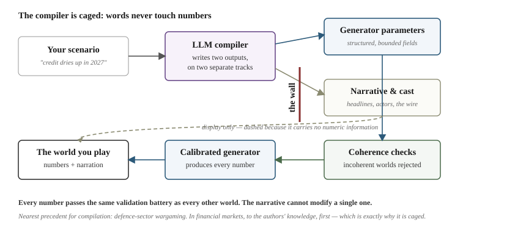
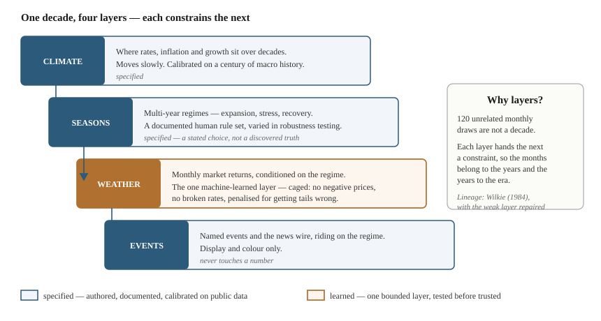
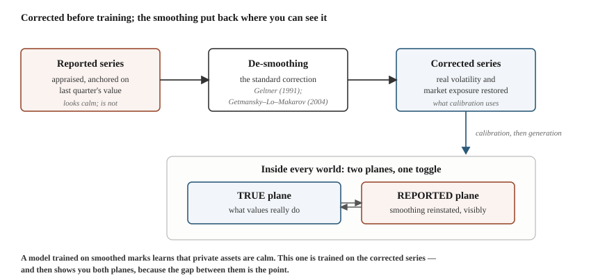
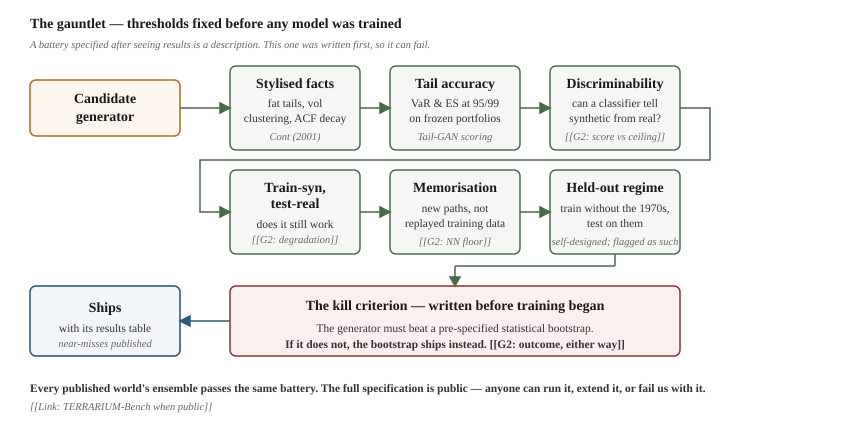
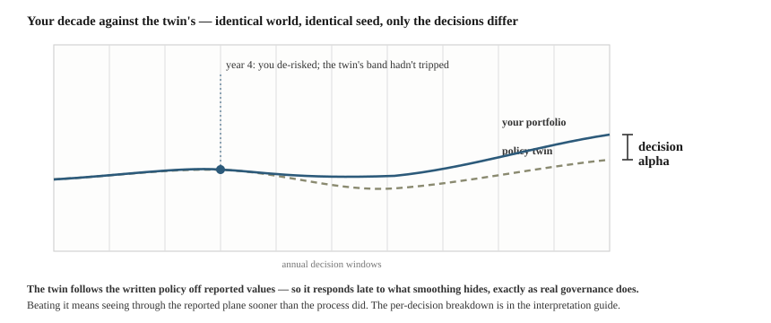

# How Terrarium Works — and How You'd Catch It Being Wrong
## D-05 · Methodology note · Draft v0.2 · August 2026 · v0.2 adds five figures

*Audience: the sceptical practitioner. Register: plain, per the wire but flatter. Everything in [[double brackets]] is a G2-dependent slot — the number or result arrives when the validation seal lands, and this document does not ship without them filled. Anchors are stable; the help agent cites into this document.*

---

## 1. Start with the two hardest questions {#hardest-questions}

Two parts of this system have no direct precedent, and you will find them faster than we can hide them — so they go first.

**Can anything generate a believable decade?** Honest answer: coherent decade-length generation is an open research problem. Nobody has solved it, including us. What we have is a specific architectural answer — four nested layers, from slow to fast, each constraining the one below — and a battery of tests it must pass before any world reaches you. The architecture is our proposal; the tests are your protection. Both are documented, and the tests were fixed before the models were trained (§6).

**A language model writes the scenarios. Why should you trust that?** You shouldn't, and the system is built so you don't have to. The compiler translates a described scenario into generator parameters and a narrative. The narrative — headlines, actors, the wire — is display only. **It cannot touch a number.** Every numeric path comes from the calibrated generator, passes the same validation battery as every other world, and is rejected if it fails economic-coherence checks. The nearest precedent for scenario compilation is in defence-sector wargaming; in financial markets, to our knowledge, this is first — which is exactly why it is caged this way.

*The cage, drawn. Words and numbers leave the compiler on separate tracks and never rejoin: parameters go through coherence checks into the calibrated generator; the narrative reaches you as display only.*

If those two answers hold up under the rest of this note, the rest is detail.

## 2. What a world is {#what-a-world-is}

A world is a complete, invented, month-by-month decade: rates, inflation, market returns, private-fund cashflows, news. It is generated from a versioned specification — a WorldSpec — plus a seed. Same spec, same seed, same decade, bit for bit, forever. That guarantee is not marketing; it is a property of the engine you can test yourself (§7).

A world is not a forecast. Worlds are built to be *plausible* — statistically indistinguishable from the kind of decade markets produce — not *probable*. Nothing in this system predicts anything, and any use of it as a prediction is a misuse.

One spec generates many decades. The scenario "inflation stays stubborn" is a distribution; each seed draws one decade from it. Your score on one decade contains luck. Your score across the ensemble does not — which is why the two are reported separately (§8).

## 3. How a decade is generated {#four-layers}

Four layers, slow to fast. Each layer constrains the one below it, which is what makes 120 months hang together as one decade rather than 120 unrelated draws.

| Layer | What it sets | Where it comes from |
|---|---|---|
| **Climate** | The slow level — where real rates, inflation, growth sit over decades | Century-scale macro history (Jordà–Schularick–Taylor panel) |
| **Seasons** | Multi-year regimes — expansion, stress, recovery — and transitions between them | A documented rule set. This is a human modelling choice, stated as such, and varied in robustness testing rather than presented as discovered truth |
| **Weather** | Monthly market returns, conditioned on the regime | The one machine-learned layer. Constrained so it cannot produce negative prices or broken rates, and trained with an explicit penalty for getting tail risk wrong |
| **Events** | Named events and the news wire riding on the regime spine | Generated; display and colour only. Never touches the path |

The lineage is older than it looks. The cascade idea — slow variables driving fast ones — is the Wilkie model from 1984, the ancestor of most regulatory scenario generators. Its known weakness was unrealistic month-to-month behaviour; the machine-learned weather layer is the repair, confined to the one place it is needed.

*The four layers. One is machine-learned, and it is fenced above by the regime it must obey and below by the events that cannot touch it.*

## 4. The inputs are corrected before anything trains on them {#desmoothing}

Private-asset returns are appraised, not traded, and appraisals anchor on last quarter's value. The result — established in the academic literature for over thirty years (Geltner 1991; Getmansky, Lo & Makarov 2004) — is that reported private-asset series understate volatility and market exposure. Materially.

A model trained on reported series learns that private assets are smooth. They are not; the smoothness is an artefact of how they are measured. So every private-asset series is **de-smoothed** — passed through the standard correction from that literature — before anything is calibrated on it. The smoothing is then put back, deliberately and visibly, as the *reported* plane inside the simulation, with the corrected series as the *true* plane beneath it.

That gap between the two planes is not a modelling nuisance. It is the thing the product exists to show you. [[Cross-reference: interpretation guide §reported-vs-true.]]

*Corrected on the way in, reinstated where you can see it. Calibration never touches a smoothed series; the simulation then carries both planes, with a toggle between them.*

## 5. Cashflows follow the framework you already use {#cashflows}

Capital calls, distributions and NAV follow the Takahashi–Alexander model — the same pacing framework most institutions already run — extended in one direction: call and distribution rates respond to market conditions instead of following a fixed schedule.

The extension is calibrated on public, allocator-side data (Robinson & Sensoy 2016: quarterly cashflows for 837 funds, taken from a limited partner's own accounting records, free of self-reporting bias), patched with recent industry aggregates for the post-2020 period. Three calibration facts worth knowing because they are counterintuitive:

- **In the GFC, buyout capital calls did not slow down.** Distributions collapsed; calls kept arriving. The self-funding breakdown that squeezes portfolios is a distribution-side phenomenon, and the engine reflects that.
- **Fund age explains far more cashflow variation than market conditions do** — the market linkage is a modest systematic tilt on a lifecycle backbone, and it is presented as such, not as a dominant driver.
- **At the level of a single fund, most cashflow variation is idiosyncratic.** A portfolio holds many funds across many vintages, so the idiosyncratic part largely diversifies away; the systematic part is what survives to portfolio level, and that is what the engine models. This is why a linkage with a modest fund-level fit is the right tool for a portfolio simulator — a point we make here before a reviewer makes it for us.

The published engine's calibration uses **public sources only** and is independently reproducible. Work with proprietary datasets is confined to a separately versioned institutional calibration, and every run record discloses which calibration produced it.

## 6. The tests it must pass — fixed before the models were trained {#battery}

Every generator, and every published world's ensemble, passes a validation battery. The thresholds were pre-registered — written down numerically before any model was trained — so the tests are capable of failing. A battery specified after seeing results is a description, not a test.

What is tested, in plain terms:

| Test | The question it answers |
|---|---|
| Stylised facts (Cont 2001) | Do generated returns have the statistical signature real markets have — fat tails, volatility clustering, the right decay of autocorrelation? |
| Tail accuracy | Are value-at-risk and expected shortfall correct at the 95th and 99th percentile, on a frozen set of benchmark portfolios? |
| Discriminability | Can a trained classifier tell synthetic paths from real ones? [[G2: report score against pre-registered ceiling]] |
| Train-synthetic, test-real | Does a model trained on synthetic data still work on real data? [[G2: report degradation against limit]] |
| Memorisation | Is the generator producing genuinely new paths rather than replaying its training data? [[G2: report nearest-neighbour floor]] |
| Benchmark comparison | Does the generator beat a pre-specified statistical bootstrap — and if it does not, the bootstrap ships instead. That kill criterion was written before training began. [[G2: report outcome, either way]] |

[[G2 SLOT — the results table. This section currently describes the battery; at the seal it reports the numbers, including any test that came in close. Publishing the near-misses is deliberate.]]

A severe test we impose on ourselves and flag as our own invention: training with an entire historical regime excluded — the 1970s — and testing on it. Self-designed tests are weaker evidence than field-agreed ones, which is why the full battery is published as an open standard others can run and extend. [[Link: TERRARIUM-Bench when public.]]

*The gauntlet. Every gate's threshold predates training; the final gate is the kill criterion, and its outcome is published either way.*

## 7. Everything replays {#reproducibility}

Every run writes a record sufficient to reproduce it exactly: world, seed, engine version, every decision you took. Any score on any leaderboard, any chart in any shared card, any claim in any publication resolves to a record that you — not we — can replay and verify. The replay guide [[link D-07]] shows how in a few minutes.

This is an unusual claim for something that looks like a game, and it is the same property that makes the engine auditable as an institutional tool. There is one system, with one discipline, wearing two interfaces.

## 8. How scoring works {#scoring}

Your result is measured against a **policy twin**: the portfolio that would have existed had you done nothing discretionary — policy weights maintained within normal rebalancing bands, commitment pacing following its plan, all computed off *reported* values, exactly as a real institution operates. Decision alpha is your terminal outcome against the twin's, on the identical decade, decomposed decision by decision.

The twin is deliberately hard to beat. It follows its policy faithfully — and because it acts on reported values, it responds late to what smoothing conceals, exactly as real governance does. Beating it means seeing through the reported plane sooner than the process did. The full construction, including the per-decision decomposition and its disclosed limitations, is in the interpretation guide [[link D-03]].

*Same decade, twice. The dashed line is the policy running faithfully off reported values; the solid line is you. The gap at the end is decision alpha — and every point of it is attributed to a specific decision.*

## 9. What this system cannot do {#limitations}

Stated here, not discovered by you later. The standalone limitations page [[link D-06]] carries the full list; the four that matter most:

1. **It cannot predict.** Plausible is the claim; probable is not.
2. **It cannot exceed its specification.** A specified model only produces worlds its designers imagined. A future crisis with a mechanism we did not author will not be in the library until someone authors it.
3. **The regime taxonomy is a choice.** Defensible, documented, varied in robustness testing — but chosen, not discovered.
4. **Simulated experience is not proven to improve decisions.** The research literature shows simulation changes *risk-taking*; whether it improves *judgement* is an open question. This platform is built to be able to test that question properly — it does not assume the answer, and neither should you.

## 10. The provenance of every component {#provenance}

Every load-bearing component cites a published ancestor; the mapping is maintained as a build artifact, and a component without a citation fails internal review. The bibliography with the component mapping attached is available at [[link: literature-to-build map, public version]]. Where a component has *no* ancestor — the scenario compiler, the decade horizon, the regime labels — it is named in §1 and §9 of this note rather than left for you to find.

---

*Not investment advice. Version [[x.y]], applies to WorldSpec [[range]], battery version [[id]]. Changelog at [[link D-10]].*
