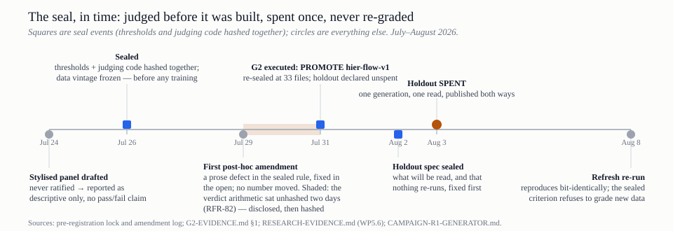
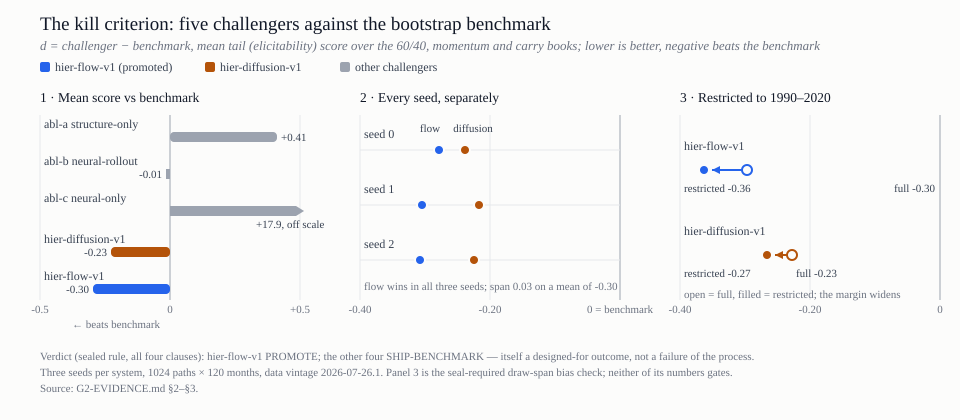

> **STATUS · SUPERSEDED — 2026-08-15.** The framing here is replaced by
> `docs/current/METHOD.md`. This document describes the platform as a
> *predictive* system built on the hierarchical generator; on 2026-08-14 the
> method turned to **prescribe, not predict** (stress scenarios: real months,
> invented sequence, precedented severity rule), and on 2026-08-11 the third
> campaign made the collagist — not the neural apprentice — the generator of
> record.
>
> It is **not** replaced as an account: no current internal methodology summary
> exists at this length, which is why the document is kept, still served by the
> tools hub, and still citable. Read it as a record of how the method was
> understood in early August 2026, not as current guidance.
>
> Index: `docs/current/README.md`.

---

# The Terrarium Method
## The approach we took, its academic underpinnings, and a plain-English guide to the process

*Internal summary · August 2026. This document consolidates; it does not replace. The
practitioner-facing account is `D-05-methodology-note.md` ("How Terrarium Works — and How
You'd Catch It Being Wrong"); the academic account is
`P1-specified-world-models-preprint.md`. Where this document and an evidence document
disagree, the evidence document wins.*

---

## 1. What this document is

Three questions, answered in order:

1. **What did we build, and by what approach?** (§2–§3)
2. **Whose shoulders is it standing on?** (§4)
3. **In plain English, how does a playable decade actually get made?** (§5)

It closes with the things we would volunteer to a referee before being asked (§6) and a
reading map into the rest of the repository (§7).

## 2. The approach in one page

**The problem.** An allocator's hardest decisions — commitment pacing, liquidity reserves,
behaviour in a drawdown — play out over a decade. Real history offers roughly one sample
per regime, and the private-asset returns in that sample are distorted by appraisal
smoothing before anyone sees them. You cannot learn decade-scale judgement from n≈1, and
you cannot calibrate on data whose volatility is an artefact of how it was measured.

**The answer: a specified world model.** Instead of forecasting the future or replaying
the past, the platform *invents* complete, internally coherent decades — rates, inflation,
market returns, private-fund cashflows, news — and lets decisions be evaluated inside
them. Worlds are built to be **plausible, not probable**: statistically indistinguishable
from the kind of decade markets produce, never a prediction. The modelling burden sits in
authored, documented structure wherever possible; machine learning is confined to the one
layer that needs it, and is caged there.

**The stack, in five moves:**

| Move | What it is | Where it lives |
|---|---|---|
| Freeze the data | Immutable, versioned vintages of every input series; corrections arrive as *new* vintages, never edits | `ah/data/` (Step 1) |
| Grow a decade | A four-layer hierarchical generator, slow to fast: climate → seasons → weather → joinery | `ah/gen/` (Step 2) |
| Translate to an institution | Sleeves, vehicles, commitment/call/distribution models, and a twin with a real cash account — carrying both a *true* and a *reported* plane | `ah/port/` (Step 3) |
| Dress it in narrative | Headlines, actors, a news wire — display only, structurally unable to touch a number | `ah/artifacts/` (Step 4) |
| Play and score | A session service that is the sole authority for value and scoring, and an evaluation layer whose criteria were fixed before the models were trained | `ah/eval/`, `ah/serve.py` (Step 5, SU) |

**The governing principle.** Every quantitative claim is one of exactly three things: (a)
pre-registered and machine-judged, (b) evidenced in an append-only record, or (c)
labelled a human judgement. Nothing is allowed to drift between categories silently.

## 3. The discipline: how we kept ourselves honest

The method is not the generator; the method is the set of constraints under which the
generator was allowed to make claims. Six constraints, each mechanically enforced.

**Pre-registration, with the judge inside the seal.** The validation thresholds *and the
code that judges them* were hashed together — sealed — before any model was trained. A
battery specified after seeing results is a description, not a test. Amendments to the
seal go through a machine-checked log; the one post-hoc amendment to date is flagged
`post_hoc: true` in the record, and the two-day window in which the verdict arithmetic
sat unhashed (RFR-82) is disclosed in the gate evidence rather than smoothed over.

*The seal, in time. The instructive entries are the uncomfortable ones — the never-ratified
panel that therefore claims nothing, the disclosed hole, and the criterion that refused to
grade a refreshed dataset because its reference vintage is part of the sealed object.*

**A benchmark with a kill criterion.** The hierarchical generator was made to race a
deliberately dumb alternative — a block bootstrap of history — under a sealed rule with
four clauses. Losing was a *designed-for outcome* with its own verdict name
(SHIP-BENCHMARK), and four of the five challengers earned it. One cleared all four
clauses on both sealed routes:

*The G2 verdict in three panels: only `hier-flow-v1` beats the benchmark (panel 1), it does
so in every seed with a spread of 0.03 on a mean of −0.30 (panel 2), and the margin
widens when the comparison is restricted to the 1990–2020 window both systems' scores are
computed against (panel 3) — so it is not a promotion of a data window.*

**Determinism and replay.** All randomness flows from one integer seed through a single
generator type. Same spec, same seed, same decade, bit for bit — `ah replay` recomputes a
stored run from its inputs and must print MATCH. This is what makes every result in every
evidence document re-derivable rather than testimonial.

**A leakage guard with teeth.** During development, held-out data was reachable only
through a token minted in one module, and an import-graph test proves no generator code
can touch it. The reference and normalization surface for training is train+validation
only — which is why, when the entire promotion campaign was re-run on a refreshed data
vintage in August, the results reproduced *bit-identically*: every difference between
vintages sat beyond the training boundary by construction.

**A one-shot holdout, spent in public.** The final held-out evaluation was declined at
promotion time (recorded as a deliberate non-spend), its reading protocol sealed first,
and then spent exactly once on owner authorization: one generation, one read, results
published both ways. Reality's 2022 drawdown stayed inside the ensemble's warning cone
(the supportive result); realized terminal wealth sat at the 99.6th percentile of the
ensemble and realized inflation escaped the bands entirely (the unsupportive results,
published with equal prominence). **There is no held-out data left.** That raises, not
lowers, the bar: no future claim can appeal to a clean test set, so no future claim gets
to be a surprise.

**Registers of known wrongness.** Failure is recorded where it happened and carried
forward: Step 3's completion gate is an honest FAIL in its evidence document; the severe
test (train with the 1970s excluded, test on them) is recorded as INCONCLUSIVE with one
leg vacuous by construction; the engine-realism register enumerates, entry by entry, the
places where the engine is faithful to its plan but not to an allocator's expectations —
and what fixing each one would invalidate.

## 4. Academic underpinnings

The design is deliberately unoriginal wherever the literature offers something tested.
The one genuinely lightly-precedented element — compiling a described scenario into
generator parameters plus a display-only narrative — is flagged as such in both public
documents.

| Component | What it does | Lineage |
|---|---|---|
| The cascade architecture | Slow variables drive fast ones, so 120 months cohere as one decade | Wilkie (1984) and its actuarial successors — the ancestor of most regulatory scenario generators. Its known weakness (unrealistic high-frequency behaviour) is exactly where the learned layer is placed |
| L1 Climate | Decade-scale levels of real rates, inflation, growth | Century-scale macro-financial panels: Jordà, Schularick & Taylor's Macrohistory Database; Bayesian state estimation |
| L2 Seasons | Multi-year regimes and their durations | Semi-Markov processes with negative-binomial sojourns; regime labels are a *declared human taxonomy*, varied in robustness grids, not presented as discovered truth |
| L3 Weather | Monthly factor returns conditional on regime — the one machine-learned layer | Conditional flow matching / rectified flow (Lipman et al. 2023; Liu et al. 2022); the financial deep-generation line: Quant GANs (Wiese et al. 2020), signature market generators (Buehler et al. 2020), Tail-GAN's elicitable tail objectives (Cont et al. 2025), diffusion models (Tanaka et al. 2025) |
| L4 Joinery | Reconciling monthly paths to annual waypoints exactly, with minimal distortion | Denton (1971) proportional benchmarking — the official-statistics temporal-disaggregation tradition |
| Acceptance battery | Stylised facts as a falsifiable specification of "looks like markets" | Cont (2001); validation practice for neural scenario generators (Flaig & Junike 2022–23) |
| De-smoothing | Correcting appraisal smoothing before calibration; reinstating it, visibly, inside the simulation | Geltner (1991) AR(1); Getmansky, Lo & Makarov (2004) MA(k) — thirty years of literature establishing that reported private-asset series understate volatility and market exposure |
| Cashflow engine | Commitments, calls, distributions, NAV over fund lifecycles | Takahashi & Alexander (2002), extended with market-linked rates calibrated on allocator-side records (Robinson & Sensoy 2016 — 837 funds from an LP's own accounting, free of self-reporting bias) |
| Factor→sleeve mappings | Liquid factor exposures of each sleeve | The Fama–French/Carhart factor tradition, kept deliberately modest: a systematic tilt on a lifecycle backbone, not a claimed alpha model |
| The evaluation frame | Ensemble-vs-realised scoring; specified rather than learned world models | The world-models line (Ha & Schmidhuber 2018; Dreamer) as the contrast class; domain randomisation and sim2real from robotics; simulation-based inference (Cranmer, Brehmer & Louppe 2020) |
| The method of science | Sealed thresholds, machine-checked amendments, one-shot holdout | Pre-registration practice imported from clinical trials and the psychology replication reform; the severe-test instinct, with the honesty that a *self-designed* severe test is weaker evidence than a field-agreed one |

Full numbered reference lists live in `Instructions/DN1.1-multiyear-generator-design-note.md`
(the generator design note) and `P1-specified-world-models-preprint.md` §11 (related work).
P1 carries the caveat that citations are page-verified before any submission.

## 5. Plain English: how a decade gets made and played

**Step 1 — freeze the ingredients.** Every input series — rates, inflation, equity
returns, credit spreads, private-fund returns — is fetched, quality-checked and stored in
a vintage that can never be edited. If a source restates history, that's a *new* vintage;
the old one stays, so any past result can be reproduced against exactly the data it saw.

**Step 2 — correct the lie in the inputs.** Private-asset returns come pre-smoothed:
appraisers anchor on last quarter's value, so the reported series looks calmer than the
economic truth. Every such series is de-smoothed before anything trains or calibrates on
it. Then — and this is the point of the whole product — the smoothing is put *back* inside
the simulation as a visible "reported" layer sitting on top of the "true" one. The gap
between those two planes is the thing an allocator most needs to internalise, and here it
is on screen instead of buried in a footnote.

**Step 3 — grow a decade, slow to fast.** Ask for a world ("inflation stays stubborn")
and the generator works like climate before weather: first the decade's slow backdrop
(where real rates and inflation sit), then the multi-year seasons (expansion, stress,
recovery, stagflation), then month-by-month market weather consistent with each season —
the one machine-learned step, fenced so it cannot produce negative prices or broken
rates — and finally a joinery pass that makes the months add up exactly to the decade's
slow story. One specification produces a whole *ensemble* of decades: the scenario is a
distribution, and each seed draws one decade from it.

**Step 4 — let it be checked.** Every ensemble passes the sealed battery — tails, stylised
facts, memorisation checks, economic coherence — against thresholds written down before
the models existed. Fail, and the world never reaches a player.

**Step 5 — translate to an institution.** The decade so far is markets. The translation
layer turns it into *your* Tuesday morning: sleeves and vehicles, capital calls that
arrive whether convenient or not, distributions that dry up in a crisis, a cash account
that can actually run out, and reported marks that stay serene while true marks fall.

**Step 6 — dress it, play it, score it.** A narrative layer writes the headlines and the
wire — colour only; it cannot move a number. You make quarterly decisions; the server
(never the client) computes value and score. Your result on the one decade you played
contains luck; your result across the ensemble does not — so the two are reported
separately, and the second is the one that means something.

And the property underneath all of it: **same specification, same seed, same decade,
forever**. Any run in the record can be replayed bit-for-bit, which is what turns "trust
us" into "check us."

## 6. What we would tell a referee before being asked

- **The standing caveat, carried into every decision:** the promoted generator beats its
  benchmark on the sealed criterion and is *not a convincing model of history* — regime
  persistence undercalled, drawdowns understated roughly 2×, and most of the decade-tier
  metrics structurally unavailable, so no decade-scale claim is made. Nothing built on it
  is decision-ready.
- **Step 3's completion gate failed honestly** (the simpler cashflow tier beat the richer
  one on the 2022 episode) and the translation layer ships with that failure recorded,
  not repaired.
- **The cashflow calibration has a named placeholder:** roughly 29% of every commitment
  is never called under the current call-rate curve, which was never fitted to allocator
  data (register entry ER-6). The requisition for real coefficients is drafted; until it
  is filled, the commitment lever stays out of the product.
- **The holdout is spent.** The one-shot evaluation supported decade-scale usability on
  the drawdown question and contradicted it on terminal wealth and inflation coverage
  (n=1 decade; confirmation, not proof). There is no clean data left to appeal to.
- **The severe test was self-designed and inconclusive**, with one leg vacuous by
  construction. Publishing the battery as an open standard others can run is the intended
  remedy, not a done thing.
- **Nothing here predicts anything.** Worlds are plausible, not probable; any use of the
  platform as a forecast is a misuse of it.

## 7. Reading map

| If you want… | Read |
|---|---|
| The practitioner-facing methodology, in full | `docs/D-05-methodology-note.md` |
| The academic argument for specified world models | `docs/P1-specified-world-models-preprint.md` |
| The generator's design note, with references | `Instructions/DN1.1-multiyear-generator-design-note.md` |
| The promotion verdict and its caveats, sealed | `G2-EVIDENCE.md` |
| The honest FAIL and the twin's limitations | `G1-EVIDENCE.md` |
| The holdout spend and the research questions | `RESEARCH-EVIDENCE.md` |
| Every known gap between engine and reality | `docs/engine-realism-register.md` |
| The August re-run proving exact reproducibility | `docs/data/CAMPAIGN-R1-GENERATOR.md` |
| The adoption question the twin still owes an answer | `docs/data/CAMPAIGN-R1-TRANSLATION.md` |

---

*Figures: `method-figA-benchmark.svg`, `method-figB-prereg-timeline.svg` — both generated
from the numbers in `G2-EVIDENCE.md` and the dates in the pre-registration record.*
