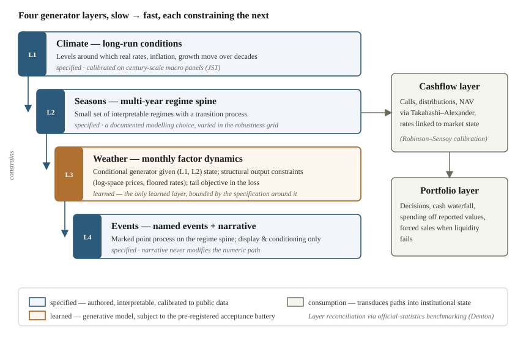
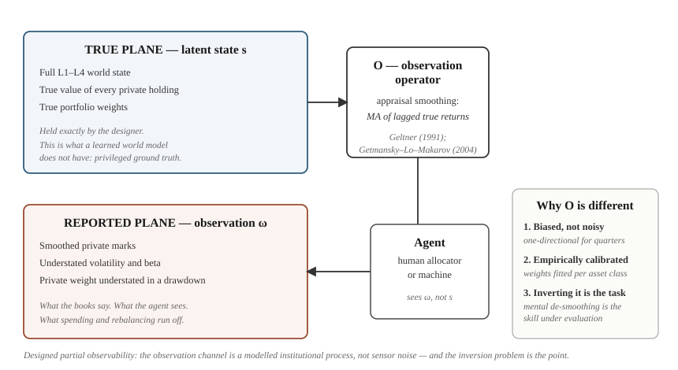
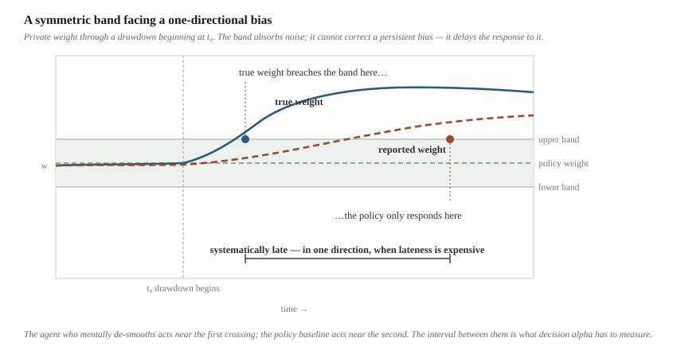
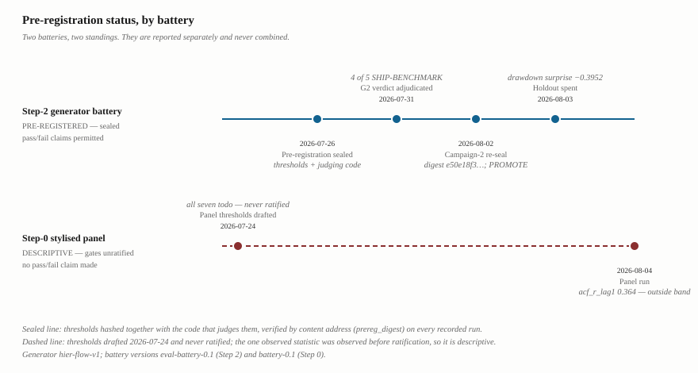
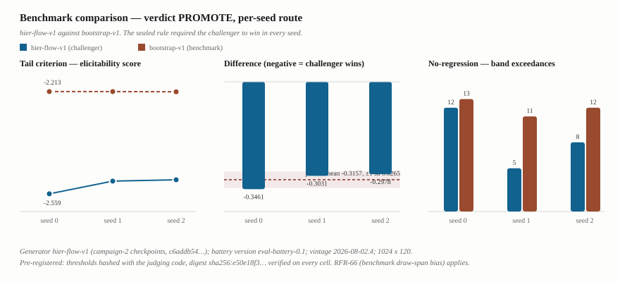
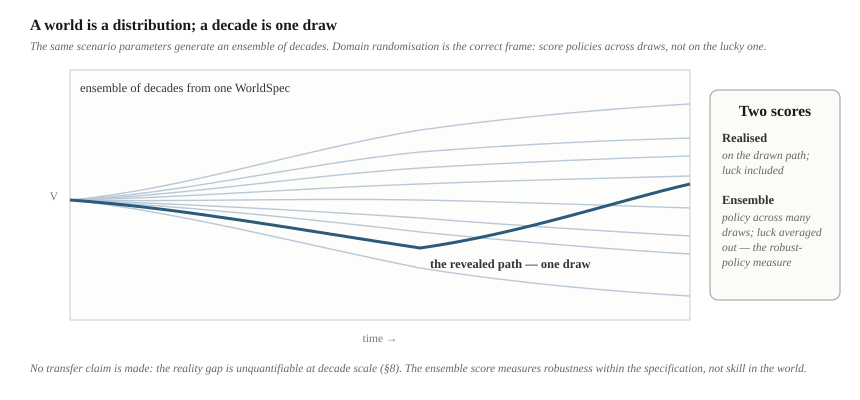

# Specified World Models
### Auditable environments for evaluating sequential decisions under designed partial observability

*Working paper · Draft v0.3 · August 2026*

*v0.3: adds §8 (empirical results) with the pre-registration status of each gate reported as a methods fact, Figures 8–9, and result sentences in §10 where an outcome now exists. v0.2 added formal definitions (§5.1), Propositions 1–2, the full-system diagram (Fig. 7), a stylised episode (§5.4), and an identification-based rewrite of §1.1.*

---

## Abstract

This paper describes a simulation environment in which every decision a portfolio allocator makes — human or machine — can be scored exactly against the decision not taken. Fixing a world and a seed fixes a complete synthetic decade; a policy baseline runs against the identical realised conditions; and a replay construction decomposes the performance difference, without residual, into per-decision contributions. Decision quality and risk appetite become separately measurable in the same run — a separation the simulated-experience literature has lacked the ground truth to make.

The design that delivers this is a **specified world model**: the latent transition dynamics are authored as an explicit hierarchical state-space model rather than learned, the observation operator is likewise authored from an established empirical literature, and generative learning is confined to a bounded layer within the specified structure. The environment is a partially observable Markov decision process whose hidden state is known to the designer and unavailable to the agent by construction.

Specification is not a retreat from the learned world models of reinforcement learning; in this domain it is forced. The available data are institutional reports, and reported private-asset returns are the true dynamics composed with a smoothing process — a composition that does not identify its components. Any learner must either absorb the distortion as dynamics or specify the observation operator to remove it. Here the operator is specified — and treated as the object of study. The resulting **designed partial observability** — a persistent, one-directional, empirically calibrated bias rather than sensor noise — is precisely the feature of institutional reality the environment exists to teach, and inverting it is the skill under evaluation.

Three further properties follow: pre-registered validation against a battery fixed before any model was trained; contract versioning of every specification; and bit-for-bit replay of every run. Section 8 reports what that battery has returned. The generator cleared every gate capable of failing it and beat a pre-specified bootstrap benchmark on the sealed tail criterion in all three seeds, under thresholds hashed together with the code that judges them; the pre-registration also records, in advance, a bias in that comparison running toward promotion. Two quantities the design lists as pre-registrable carry no sealed bound and are reported descriptively; a second battery covering summary stylised facts remains unratified, and its one observed statistic is outside its drafted band; the held-out-regime test was inconclusive; and no decade-scale claim is made, because most decade-tier metrics are structurally unavailable and the negative control for that tier does not fail. The limitations are stated plainly: specification bounds the environment by the modeller's imagination, long-horizon coherent generation remains an open problem, and no claim of predictive validity is made or intended.

---

## 1. Introduction

An institutional allocator experiences perhaps three or four market cycles in a career. Each is observed once, without replication, without a control condition, and with the outcome confounded by everything else that happened at the same time. The counterfactual — what would have happened had the committee decided otherwise — is never available. As a training environment for a difficult skill this is close to worst case, and it is the environment in which decisions governing a substantial share of global institutional capital are made.

This paper describes an environment in which that counterfactual exists.

Fix a scenario and a seed, and a complete synthetic decade is fixed with it: every macro state, every market return, every capital call. An allocator — human or machine — lives the decade month by month, deciding at intervals, seeing only what an institution would see. A policy baseline runs against the identical realised conditions. At the end, a replay construction decomposes the performance difference into per-decision contributions that sum exactly to the total (Proposition 1): each decision receives a score, against the same world, on the same path, differing only in the decision. The environment can be run ten thousand times, validated against a battery fixed before its models were trained, and replayed bit-for-bit from any published result (Proposition 2).

Two capabilities follow that appear to be new in this setting. **Per-decision evaluation with ground truth** — decision quality measured directly rather than inferred from a terminal outcome confounded by luck. And **the separation of judgement from risk appetite**: the experimental literature on simulated experience has shown that experience changes risk-taking, but has been unable to establish whether it improves decisions, because it has lacked a counterfactual to score them against. This environment supplies one, and can therefore measure both quantities in the same run and report which moves.

### 1.1 The design that delivers this, and why it is forced

The environment is a **specified world model**: its latent transition dynamics are authored as an explicit hierarchical state-space model — calibrated to public historical panels and published empirical research — rather than learned from data, and its observation operator is authored from the appraisal-smoothing literature. Generative learning is retained in one bounded layer, for monthly market dynamics conditioned on the specified regime state, where data are dense and the properties to be reproduced are agreed.

This is the opposite of the prevailing design. **World models** in reinforcement learning are learned: Ha and Schmidhuber (2018) trained a controller entirely inside a learned dream; the Dreamer line (Hafner et al.) formalised latent imagination at increasing scale and generality. Given that lineage's success, placing the modelling burden in an authored specification needs justifying — and the justification is that in this domain, specification of the critical component is not a choice.

**The identification problem.** The data available for learning are institutional reports, and reported private-asset returns are not draws from the true dynamics. They are the true dynamics passed through a reporting process: Geltner (1991) showed appraisal-based real-estate returns are a smoothed transformation of true returns; Getmansky, Lo and Makarov (2004) generalised this to hedge-fund returns as a moving average of true returns with estimable weights. Formally, the learner observes the composition *O∘T* — reporting distortion composed with transition dynamics — and **the composition does not identify its components.** Any factorisation requires assumptions about *O*: its moving-average structure, its lag length, its asymmetry under stress. A learned world model must therefore either (a) absorb the distortion into its dynamics, learning that private assets are smooth — the precise misconception the environment exists to correct — or (b) specify *O* to remove it, at which point specification has been conceded for the component that matters most. This is not an argument about today's architectures. More data, transfer learning, or foundation-model priors do not resolve it, because the missing information is not in the reported series at any sample size.

Three practical properties point the same way. **Data are scarce at the relevant frequency**: private-asset returns arrive quarterly, so twenty years is eighty observations spanning perhaps three regime cycles — and the rare, slow phenomena a decade-scale environment must reproduce appear in that history a handful of times each. **The horizon is long**: a useful episode is roughly 120 months of coherent macro-financial evolution, and coherent generation at that horizon remains an open problem in the generative time-series literature. **The environment must be defensible**: institutional deployment brings model risk management — documentation, effective challenge, independent validation — and a latent dynamics model with no interpretable state and no pre-registered acceptance criteria is difficult to validate component by component, as a property of the representation rather than of the validator's effort.

The identification argument does the philosophical work. If the observation operator must be specified anyway, the question is no longer *whether* to specify but *how much*, and the answer defended here is: everything slow, structural, and institutionally meaningful, with learning confined to the layer where data are dense and the target properties are agreed.

### 1.2 The design point

The result is not a better world model in the RL sense. It is a different object with a different purpose: not a substrate for training an agent efficiently, but **an instrument for evaluating a decision-maker credibly.** The observation operator, far from being a nuisance to be filtered, becomes the object of study — a structured, persistent, one-directional distortion whose inversion is the skill under evaluation (§5).

### 1.3 Contributions

1. An identification argument for why the observation operator in this domain must be specified rather than learned, and a characterisation of **specified world models** as a design point between learned latent dynamics models and classical economic scenario generators (§1.1, §3).
2. A formal treatment of the environment as a POMDP with authored hidden state, and of the observation operator as a first-class modelled object — the distinction between **incidental** and **designed** partial observability (§5).
3. Two propositions: exact, unique decomposition of terminal performance into per-decision contributions under a fixed exogenous path (Proposition 1, §7), and bit-for-bit reproducibility under versioned specification (Proposition 2, §6).
4. A stylised episode demonstrating the mechanics end to end (§5.4), and an evaluation protocol that separates decision quality from risk appetite (§7).
5. A statement of what does and does not transfer, in sim2real and domain-randomisation vocabulary, and a plain account of limitations (§8–9).

---

## 2. Background

### 2.1 Learned world models

Ha and Schmidhuber (2018) combined a variational autoencoder for perception with a mixture-density recurrent network for dynamics, and trained a small controller inside the learned model. The Dreamer line replaced this with a recurrent state-space model learning both deterministic and stochastic latent components, and demonstrated that behaviours learned by imagination in the latent space transfer to the underlying environment across a broad task range.

The value proposition is sample efficiency: interaction with the real environment is expensive, so learn a surrogate and interact with that. The implicit assumption is that the real environment is *available for interaction* often enough to fit the surrogate, and that the learned latent state need not be interpretable because nothing downstream requires it to be.

Neither assumption holds in this setting.

### 2.2 Economic scenario generation

Finance has generated synthetic paths for decades. The Wilkie (1984) cascade structure — a slow inflation process driving faster asset processes — is the direct structural ancestor of the layered architecture described here, and its known weakness, Gaussian innovations bolted onto an economically sensible skeleton, is precisely the weakness a modern generative layer repairs.

The recent generative literature is substantial. TimeGAN (Yoon et al., 2019) contributed both an architecture and the evaluation vocabulary the field now shares — discriminative and predictive scores, train-on-synthetic-test-on-real. Quant GANs (Wiese et al., 2020) and diffusion-based approaches such as CoFinDiff (Tanaka et al., 2025) demonstrate controllable conditional generation of financial series. Buehler et al. (2020) build market generators on rough-path signatures, explicitly targeting settings where data are short and irregularly sampled. Cont et al. (2025) show that tail behaviour can be made a training objective rather than a hope, by exploiting the joint elicitability of value-at-risk and expected shortfall. Cohen, Reisinger and Wang (2023) impose no-arbitrage conditions structurally on neural stochastic differential equations, so that every simulated state is economically valid by construction. Flaig and Junike (2022, 2023) demonstrate a neural scenario generator operating at regulatory scope, with a companion validation methodology for machine-learning generators.

This literature is generative and increasingly rigorous. What it does not generally do is produce **coherent decade-length paths carrying an explicit, auditable regime narrative and a modelled distinction between reported and true values** — because it is mostly aimed at short-horizon risk measurement, where neither is required.

### 2.3 The gap

Learned world models supply long-horizon rollout and agent evaluation but assume abundant interaction and tolerate opaque state. Economic scenario generators supply financial realism and validation practice but are typically short-horizon and do not model the decision-maker. Neither treats the gap between reported and true value as a modelled object rather than a data-cleaning step.

---

## 3. Specified world models

**Definition.** A specified world model is a simulation environment in which (i) the latent state variables and their transition dynamics are authored explicitly with reference to domain theory and empirical calibration; (ii) the observation operator mapping latent state to agent-visible data is likewise authored; and (iii) learned generative components, where used, are confined to bounded roles within the specified structure and are subject to acceptance tests defined before training.

The design point sits between two familiar ones:

| | Learned world model | **Specified world model** | Classical ESG |
|---|---|---|---|
| Transition dynamics | Learned latent | **Authored, interpretable** | Authored, parametric |
| Generative flexibility | High | **Bounded, inner layer** | Low |
| Latent state interpretability | Low | **High, by construction** | High |
| Ground truth for evaluation | Unavailable | **Available to designer** | Available |
| Observation distortion | Not modelled | **Modelled explicitly** | Not modelled |
| Validation posture | Difficult | **Pre-registered battery** | Established |
| Data requirement | Very high | **Moderate** | Low |
| Risk | Learns the wrong thing | **Cannot express what was not authored** | Unrealistic dynamics |

The final row is the design's principal cost; §9 returns to it. A specified model can only produce worlds the specification admits. A learned model can in principle discover structure the modeller never considered. That is a real advantage of the learned approach, and no claim is made against it. The claim is narrower: in this domain the trade is worth making, because the properties bought — auditability, ground truth, and a modelled observation channel — are prerequisites rather than luxuries.


*Figure 1. The design point on the flexibility–structure line. Each neighbour's characteristic weakness is stated beneath it; the specified model's own cost — expressiveness bounded by the modeller's imagination — is stated with the same prominence.*

---

## 4. Architecture

The environment generates worlds through four nested layers, each constraining the layer below.

**L1 — climate.** Slow-moving long-run conditions: the level around which real rates, inflation and growth fluctuate over decades. Calibrated on century-scale macro-financial panels, which are the only data built to study rare, slow phenomena across multiple regimes.

**L2 — seasons.** A multi-year regime spine: a small number of interpretable macro-financial regimes with a transition process. This layer has no direct ancestor in the generative literature; the regime taxonomy is a modelling choice, documented as such and varied across a robustness grid rather than presented as discovered.

**L3 — weather.** Monthly factor dynamics conditioned on the L1 and L2 state. **This is where learning lives.** The conditional generator produces monthly returns across the factor set, subject to structural constraints on the output coordinates — log-space prices, floored rates, bounded spreads — following the principle that economic validity belongs in the architecture rather than in a penalty term. A tail-risk objective on a frozen set of benchmark strategies is included in the loss rather than left to acceptance testing alone.

**L4 — events.** Named events riding on the regime spine as a marked point process, plus the narrative surface. Events are display and conditioning objects; they do not modify the numeric path.

Two consumption layers sit above the generator. A **cashflow layer** transduces market paths into private-fund capital calls, distributions and net asset values, following the Takahashi–Alexander recursions with call and distribution rates linked to market state, calibrated on published allocator-side cash-flow research. A **portfolio layer** applies decisions, maintains a cash waterfall, and produces forced sales when liquidity demands exceed available liquid assets.

Layer reconciliation — ensuring monthly paths aggregate to the annual behaviour the slower layers specify — uses established benchmarking methods from official statistics rather than an ad hoc adjustment.



*Figure 2. The architecture. Learning is confined to L3, where data are adequate and the stylised facts to be reproduced are agreed; everything around it is specified. The consumption layers transduce market paths into institutional state — including the reported/true distinction and forced sales.*

---

## 5. The POMDP, and designed partial observability

### 5.1 Formulation

The environment is a partially observable Markov decision process ⟨S, A, T, Ω, O, R⟩. Each component is defined in turn.

**State.** The latent state factorises as

```
s_t = (x_t, r_t, m_t, c_t, p_t)
```

where *x_t* ∈ ℝ^{d_x} is the slow macro-climate state (L1); *r_t* ∈ {1,…,R} is the regime (L2); *m_t* ∈ ℝ^{d_m} is the vector of monthly factor levels (L3, log coordinates); *c_t* collects per-sleeve private-fund state — commitment, paid-in capital, unfunded balance, true net asset value, and cohort age, i.e. *c_t^i = (K^i, PIC^i_t, U^i_t, N^i_t, a^i_t)* for sleeve *i*; and *p_t* is portfolio state — holdings by sleeve and the cash balance.

**Transition.** *T* factorises hierarchically, matching §4:

```
x_{t+1} ~ T_1(· | x_t)                       specified, slow
r_{t+1} ~ T_2(· | r_t, x_{t+1})              specified Markov spine
m_{t+1} ~ G_θ(· | m_t, r_{t+1}, x_{t+1})     learned, constrained support
c_{t+1} = T_C(c_t, m_{t+1})                  specified recursions (calls, distributions, NAV)
p_{t+1} = T_P(p_t, c_{t+1}, m_{t+1}, a_t)    deterministic accounting given the action
```

Only *G_θ* is learned, and its support is constrained structurally (log-space prices, floored rates). Everything else is authored and calibrated. Conditional on the realised draw of exogenous randomness — fixed by world *w* and seed σ — the entire transition is deterministic in *(s_t, a_t)*.

**Observation.** The agent does not see *s_t*. The observation operator acts componentwise, and its non-trivial component is the reporting kernel on private values:

```
Ñ^i_t = Σ_{k=0..q} φ^i_k N^i_{t−k},    Σ_k φ^i_k = 1,   φ^i_k ≥ 0
```

— reported NAV as a finite moving average of true NAV, the Getmansky–Lo–Makarov form, with weights φ^i estimated per sleeve from the de-smoothing literature. The observation is then

```
ω_t = O(s_t, …, s_{t−q}) = (m_t, c̃_t, p̃_t, e_t)
```

where *c̃_t*, *p̃_t* are fund and portfolio state valued at reported rather than true NAV, and *e_t* is the revealed event stream. Public factor levels are observed exactly; private values are observed through the kernel. *O* is deterministic, known to the designer, and unknown in its realised effect to the agent — who knows smoothing exists but does not observe *N^i_t*.

**Actions.** *A* comprises the allocator's instruments: public-sleeve rebalancing, commitment-pacing changes, and voluntary secondary sales, exercised at decision windows *k = 1…K*.

The distinguishing feature is that **the designer holds *s_t* exactly.** In a learned world model there is a latent state but no privileged ground truth about what it means. Here the true value of every private holding at every date is known, because it was generated before it was obscured. Reward is deferred to §7: the question of interest is what to score, not how to discount.


*Figure 7. The full stack. Solid arrows are the generative direction; the agent sees only the observation plane; the replay harness (right) re-runs the identical exogenous path under hybrid action sequences to produce per-window contributions.*

### 5.2 The observation operator as a modelled object

In most POMDP formulations partial observability is a nuisance: sensor noise, occlusion, a stochastic mask the agent must average over. The observation function is usually zero-mean and the optimal response is filtering.

Here the observation operator is the institutional reporting process, and it has three properties that make it a different kind of object.

**It is biased, not noisy.** Appraisal smoothing produces reported values as a weighted average of current and lagged true values. Under a drawdown this is not zero-mean error — reported private weight understates true private weight for several consecutive quarters. Filtering noise and correcting a persistent one-directional bias are different problems, and standard institutional machinery designed for the former (rebalancing bands, which are symmetric deadzones) does not solve the latter. It delays the response to it.

**It has an empirical functional form.** The operator is not invented for the simulation. It is the moving-average smoothing model estimated in the de-smoothing literature, with weights fitted per asset class. The environment's partial observability is therefore *calibrated*, which is unusual.

**Inverting it is the skill under evaluation.** The agent that mentally de-smooths acts on the true state before the reported state has moved enough to trigger a policy response. This is not an artefact of the environment design; it is a documented feature of the domain, and making it the object of evaluation is the point.

The term proposed for this is **designed partial observability**: an observation operator that is itself a modelled institutional process with empirical support, where the inversion problem is the task rather than an obstacle to it.



*Figure 3. Designed partial observability. The observation operator is the institutional reporting process — biased rather than noisy, empirically calibrated, and the object whose inversion constitutes the skill under evaluation.*

### 5.3 The consequence in the environment

Because the operator is explicit, the environment can present both planes. Every private holding carries a reported value and a true value; the agent sees the reported plane by default and — as a design choice in the interface, and as an experimental treatment in §7 — may be shown the true plane alongside it. The gap between them is not a modelling residual to be minimised. It is the subject.

### 5.4 A stylised episode

The following illustrates the mechanics on a single decision window. **It is a constructed illustration of the environment's behaviour, not an empirical result**; magnitudes are chosen for clarity and are consistent with the calibration literature cited, nothing more.

Consider a 2022-shaped decade, seven months into a public-market drawdown of roughly 20%. Policy private weight is 25% with a ±3pp band. The state of the world:

| Quantity | True plane | Reported plane |
|---|---|---|
| Private NAV | down ~12% from peak | down ~3% (kernel lag) |
| Private weight | **31.4%** | **26.8%** |
| Band breach (28%)? | Yes, four months ago | No |
| Unfunded / liquid assets | rising — calls arriving on schedule, distributions collapsing | same (cashflows are observed exactly) |

Three participants face this state.

**The policy baseline** sees 26.8% against a 28% trigger. Nothing has breached. It holds, continues spending off the smoothed trailing average of reported value, and meets capital calls from a shrinking liquid pool. Its band will trip roughly three quarters later, when the kernel catches up — after the liquid sleeve has been further depleted.

**An agent using only the reported plane** faces the same screen and, absent a reason to distrust it, plausibly does the same.

**An agent who de-smooths** — mentally, or with the true plane revealed as the §7 treatment arm — sees 31.4%, a binding overweight, and a coverage ratio deteriorating. Acting now, it trims public risk while public assets retain value and throttles new commitments knowing the effect arrives years out. When the reported plane finally shows what the true plane showed all along, this agent's forced-sale exposure is lower and its window contribution *c_j* records the difference.

The point of the illustration is narrow: **every quantity in it is well-defined in the environment because both planes exist and the operator between them is authored.** The episode cannot be constructed in a learned world model — there is no true plane to compare against — and it cannot be scored in the field, because the counterfactual committee that acted four months earlier does not exist. Here it is one replay.

---

## 6. Why specification enables validation

Three properties follow from authoring the environment rather than learning it, and each maps onto a requirement institutional deployment actually imposes.

**Pre-registered acceptance.** Because the state variables and their intended behaviour are named before any model is trained, numeric pass/fail thresholds can be fixed in advance: tail-index tolerance bands, autocorrelation profile distance for absolute returns, discriminative-score ceilings, train-on-synthetic-test-on-real degradation limits, value-at-risk and expected-shortfall backtest error bounds, and a memorisation floor. That is the argument for what specification *permits*; §8.4 reports which of these were in fact sealed with a bound and which were not, and the discriminative-score and degradation quantities were not. Pre-registration is what makes a validation gate capable of failing. A battery specified after results are seen is a description, not a test.

**Contract versioning.** The specification is expressed as a versioned schema — the parameters that define a world, the generator identity, the constraint set, the calibration provenance, the evaluation protocol version. Every generated world states what produced it. This is an engineering contribution rather than a research one, but it is the difference between a reproducibility claim and a reproducibility guarantee.

**Bit-for-bit replay.** Every run writes a record sufficient to reconstruct it exactly. Any published result, any score, any claim resolves to a replayable artifact. This property is also load-bearing for the evaluation protocol in §7, which requires deterministic re-execution of the same exogenous path under counterfactual action sequences. It can be stated as a (deliberately modest) formal guarantee:

> **Proposition 2 (Reproducibility under versioned specification).** *Let a run record ρ = (w, σ, v, **a**) comprise a world specification w, a seed σ, an engine version v, and an action sequence **a**. If (i) every stochastic draw in the engine is a deterministic function of (w, σ) under version v, and (ii) the transition and observation maps of §5.1 contain no source of randomness outside those draws, then the map ρ ↦ (s_{1:T}, ω_{1:T}, V) is a function: any two executions of ρ produce identical state paths, observation paths, and terminal value.*
>
> *Proof.* By (i) the exogenous draw sequence is a fixed function of (w, σ, v). Given the draws, §5.1 defines s_{t+1} as a deterministic function of (s_t, a_t) and ω_t as a deterministic function of (s_t,…,s_{t−q}) by (ii). The claim follows by induction on t. ∎

The content is not the induction, which is trivial; it is that conditions (i) and (ii) are **design obligations the specification makes checkable** — a named RNG discipline and a versioned engine — and that a learned latent model satisfies neither in a form a third party can verify. Determinism here is an auditable property of an authored system, not an empirical observation about one.

A learned latent dynamics model can be evaluated — on likelihood, on downstream task performance, on rollout fidelity. What it cannot easily do is be *validated* in the model-risk sense: assessed component by component against criteria fixed in advance by someone who is not the developer. Specification is what makes the components addressable.

One corollary should be noted: none of this establishes that the environment is *right*. It establishes that it is checkable, and that its failures are discoverable by third parties. Those are different claims, and only the second is made here.

---

## 7. Evaluation: separating decision quality from risk appetite

### 7.1 The exact counterfactual

Fix a world and a seed. The exogenous path — every macro state, every factor return, every event — is then identical across agents. Two agents differ only in their actions, and a baseline policy can be run against the same realised conditions.

Let decision windows be *k = 1…K*, let **a** be the agent's action vector and π the baseline policy. Define the hybrid terminal value

```
H_j = V(a_1 … a_j, π_{j+1} … π_K)
```

so that *H₀* is the baseline throughout and *H_K* is the agent throughout. Proposition 2 guarantees each *H_j* is well-defined: the replay is a function of the run record.

> **Proposition 1 (Exact sequential decomposition).** *Fix (w, σ, v) and let H_j, j = 0…K, be the hybrid terminal values above, with H₀ > 0. Define A = (H_K − H₀)/H₀ and c_j = (H_j − H_{j−1})/H₀. Then:*
> *(a) (Exactness) Σ_{j=1..K} c_j = A, with no residual.*
> *(b) (Null decision) If a_j = π_j then c_j = 0.*
> *(c) (Uniqueness) {c_j} is the unique attribution consistent with the sequential counterfactual "the agent's decisions through j, the policy thereafter": any attribution assigning window j the change in terminal value from switching a_j into that counterfactual equals c_j.*
>
> *Proof.* (a) The sum telescopes: Σ(H_j − H_{j−1})/H₀ = (H_K − H₀)/H₀ = A. (b) If a_j = π_j the action sequences defining H_j and H_{j−1} are identical, and by Proposition 2 identical run records produce identical terminal values, so c_j = 0. (c) The sequential counterfactual at window j is exactly the pair (H_{j−1}, H_j); any attribution defined on that pair as the normalised difference coincides with c_j by construction. ∎

Part (b) is the implementable test: an agent that never deviates from policy scores exactly zero in every window, which catches most implementation errors. Part (c) is deliberately scoped — uniqueness holds *given* the sequential counterfactual, and the choice of that counterfactual over order-symmetric alternatives is a design decision defended below, not a theorem.

Each window's contribution answers a well-posed question: what did this decision add, given everything already done? The decomposition is the definition of the measure rather than a post-hoc attribution, which is what makes it reconcile without residual.


*Figure 5. The hybrid replay construction. Rows H₀ and H_K already exist (the baseline and the completed run); the K−1 interior rows are deterministic replays. Consecutive differences telescope to the terminal difference with no residual.*

Two properties follow. The construction requires *K+1* deterministic replays of an identical path, which is only possible because of §6. And it is order-dependent: interactions between windows are attributed to the earlier one. Shapley values remove the arbitrariness at exponential cost and would produce contributions corresponding to no path the agent could have taken; the sequential construction is preferred, with its property disclosed rather than concealed.

### 7.2 The baseline must be the realistic counterfactual

The natural baseline is inaction, but inaction is ambiguous. A baseline that never rebalances is easy to beat and corresponds to no institution's behaviour. A baseline that maintains policy weights within tolerance bands, rebalancing off *reported* values as institutions actually do, is harder to beat and is what would genuinely have happened.

The second is correct, with one consequence: the baseline inherits the environment's central pathology. Its bands are symmetric deadzones facing a one-directional bias, so it responds late in exactly the states where lateness is costly. Decision value therefore measures, in part, the ability to see through the reported plane faster than the governance process does — which is a coherent thing to measure and a defensible thing to reward.



*Figure 4. Why bands fail against bias. The band is a symmetric deadzone built for noise; appraisal smoothing in a drawdown is a persistent one-directional bias. The interval between the two band crossings is the baseline's structural lateness — and the room in which decision alpha is earned.*

### 7.3 The measurement this permits

The experimental literature on simulated experience has a robust finding and a robust limitation. Experiential sampling changes risk-taking; whether it improves *decision quality* is not established, because field and laboratory designs generally lack a ground-truth counterfactual against which a decision can be scored.

A specified world model supplies exactly that counterfactual. Decision quality (*A* against the baseline on a fixed path) and risk appetite (ex-ante risk of the chosen allocation at each window) are separately measurable in the same run. Whether they move together, separately, or in opposite directions becomes an empirical question with a clean answer.

**This is the paper's most consequential claim, and the result is not asserted.** The instrument is the contribution; the finding is future work, and is worth reporting whichever way it comes out.

### 7.4 Machine decision-makers

The same protocol applies unchanged to an automated agent. Language-model systems are beginning to be applied to allocation and diligence workflows, and there is at present no rigorous way to assess whether they are any good at it — for the same reason there is no rigorous way to assess a human allocator: the counterfactual is unavailable and the sample size is one.

An environment with known ground truth, an exact baseline, per-decision scoring and unlimited replication is a natural benchmark substrate. This is flagged as a motivating application rather than a demonstrated result; no agent evaluation is reported here.

---

## 8. Empirical results

This section reports what the validation apparatus of §6 has so far produced. It is placed before the sim2real discussion because the standing of these results bears on what can be claimed about transfer.

### 8.1 Two batteries with different evidentiary standing

The system carries two validation batteries, and they are not interchangeable. Reporting them as one would misstate both, so they are separated here as a methods fact.

The **generator battery** evaluates the hierarchical generator across eight metric suites. Its thresholds are hashed together with the code that judges them into a lock file; the first seal is dated 2026-07-26 and the operative seal 2026-08-02. Every recorded run embeds the digest of the pre-registration it was judged against, and that verification is a content-address check: the digest is recomputed from the hashed files, read fresh from disk, and compared against the digest the lock records. Results from this battery are reported as pre-registered pass or fail.

The **stylised panel** is a seven-statistic summary applied to a separate deterministic engine. Its thresholds were drafted 2026-07-24 and have never been ratified; all seven carry the status `todo` in the file that defines them, which describes them as "placeholders documenting intent, not ratified thresholds". Results from this battery are reported as descriptive, and no pass or fail is claimed from them.

| | Generator battery | Stylised panel |
|---|---|---|
| Threshold artifact | `pre-registration.yaml`, hashed with judging code | `thresholds.yaml` |
| Seal | `sha256:e50e18f3…f85d92`, sealed 2026-08-02 | none |
| Ratified gates | five at enforce severity, plus report-severity bounds | none of seven |
| Verification | content-address, per run | not applicable |
| Standing | pre-registered | descriptive |



*Figure 8. Pre-registration status by battery. Generator `hier-flow-v1`; battery versions `eval-battery-0.1` and `battery-0.1`.*

**A disclosure about the ordering evidence.** The operative seal and the verdict it judges carry the same date, and chronological ordering within that day is not recoverable from the repository. The claim that the verdict was computed against the sealed thresholds therefore rests on content-address linkage rather than on timestamps: each recorded cell embeds `sha256:e50e18f3…f85d92`, matching the sealed lock. **Superseded 2026-08-06:** the lock was re-minted twice that day (AM-2026-08-06-001 ratifying five Step-0 gates, then -002 withdrawing one), so the operative digest is now `sha256:bf0b6d89…b58d`. The campaign-2 results reported here were verified against `sha256:e50e18f3…f85d92`, the lock as it stood when they were produced; that verification is unaffected, but a reader recomputing the digest against today's tree will get the newer value. This is the stronger form of the evidence — a hash match establishes *what* was judged, where a timestamp establishes only *when* — but it is a different argument from commit ordering, and it is stated rather than elided. One qualification travels with it: the per-cell records carrying the digest are not committed to the repository, so the linkage is verifiable where those artifacts exist rather than from the published tree alone.

### 8.2 The gates capable of failing

The generator battery's enforce surface is five statistics. That restriction is recorded in the pre-registration itself, on the stated grounds that the remaining bounds rest on an unmeasured null distribution, and that a gate nobody derived is not a gate. All five passed, for both systems, at vintage `2026-08-02.4`, seed `20260727`, ensemble 1024 × 120.

| Gate | Bound | `hier-flow-v1` | Margin | `bootstrap-v1` | Margin |
|---|---|---|---|---|---|
| `moment_band_exceedance_fraction` | ≤ 0.5 | 0.2333 | 0.2667 | 0.0667 | 0.4333 |
| `dependence_band_exceedance_fraction` | ≤ 0.5 | 0.2667 | 0.2333 | 0.4222 | 0.0778 |
| `near_duplicate_fraction` | ≤ 0.5 | 0.0913 | 0.4087 | 0.0566 | 0.4434 |
| `money_pump_violations` | ≤ 0.0 | 0.0 | at bound | 0.0 | at bound |
| `floor_violations` | ≤ 0.0 | 0.0 | at bound | 0.0 | at bound |

Two features of that table resist summary. The benchmark clears the dependence gate by 0.0778, the narrowest margin recorded anywhere in the battery. And the two systems are not consistently ordered: the benchmark sits further inside on moments, the challenger further inside on dependence. Neither dominates on the surface that can fail.

### 8.3 The kill criterion

The pre-specified rule required the challenger to beat the benchmark on the tail criterion, the benchmark shipping otherwise. The rule was sealed before the comparison was executed. The challenger won in every seed.

| Seed | Challenger | Benchmark | Difference | Band exceedances (C / B) |
|---|---|---|---|---|
| 0 | −2.5591 | −2.2131 | −0.3461 | 12 / 13 |
| 1 | −2.5163 | −2.2132 | −0.3031 | 5 / 11 |
| 2 | −2.5116 | −2.2139 | −0.2978 | 8 / 12 |

Pooled mean difference −0.3157, standard deviation 0.0265 across three seeds, satisfying the sealed requirement that the absolute mean exceed the standard deviation. The verdict was PROMOTE. Of five systems evaluated under the same rule, four received the opposite verdict — the benchmark ships — which the design treats as a legitimate outcome rather than a failure of the exercise.



*Figure 9. Benchmark comparison. Generator `hier-flow-v1` (campaign-2 checkpoints); battery version `eval-battery-0.1`; vintage `2026-08-02.4`.*

**The pre-registration records a bias in its own favour.** The sealed decision rule carries a disclosure that the head-to-head is biased toward promotion by the benchmark's data window. The benchmark can only resample 1990–2020, whose worst equity drawdowns are 2000–02, 2008–09 and 2020, while the challenger was fitted on a span including 1929–33, 1937, 1973–74 and 1987; both are then scored against realisations spanning the longer period. On any statistic rewarding reproduction of the deep pre-1990 left tail, the benchmark is handicapped by its window rather than by its form. Because the design treats a benchmark-ships verdict as a success, the bias runs against the conservative outcome. It was written into the seal before the comparison was run, and is reported for that reason: a pre-registration that records the thumb on its own scale is evidence about the discipline rather than an embarrassment to it.

The same disclosure binds the evidence record to re-run the comparison restricted to the 1990–2020 realisations both systems are scored against, where the benchmark's window handicap does not apply. Under that restriction the challenger's mean difference moves from −0.296723 to −0.363470 and the pooled beat holds, so the verdict is not an artifact of the benchmark's draw span. Those are the G2-era figures at vintage `2026-07-26.1`, distinct from the campaign-2 numbers above.

### 8.4 Memorisation, and two statistics with no threshold

Memorisation bounds were sealed at report severity. The generator sits above both nearest-neighbour floors and below the membership-inference ceiling.

| Statistic | Bound | `hier-flow-v1` | `bootstrap-v1` |
|---|---|---|---|
| `nn_distance_p05` | ≥ 0.0279 | 0.5541 | 0.6423 |
| `nn_distance_p50` | ≥ 1.0371 | 1.3918 | 2.3641 |
| `membership_inference_auc` | ≤ 0.75 | 0.4237 | 0.2939 |

The generator sits closer to its training set than the resampler does on all three, which is what one expects of a learned model against a bootstrap of history, and is recorded rather than left implicit.

Two quantities that §6 lists among the pre-registrable thresholds — discriminative-score ceilings and train-on-synthetic-test-on-real degradation limits — are computed but **carry no sealed bound**. Both were registered at report severity with neither minimum nor maximum. They are therefore descriptive, and no pass or fail is claimed of them:

| Statistic | Bound | `hier-flow-v1` | `bootstrap-v1` |
|---|---|---|---|
| `discriminative_score` | none sealed | 0.0310 | 0.1472 |
| `predictive_score` | none sealed | 0.5302 | 0.5206 |
| `tstr_degradation` | none sealed | 1.0846 | 1.0649 |

### 8.5 What the battery does not establish

Sixteen of twenty-two decade-tier metrics are structurally unavailable for every generator: fourteen because no generator emits a path longer than its own horizon, and two because no valuation factor is mapped. The negative control designated to that tier, whose time ordering is destroyed outright, produces no substantive failures in it. **No decade-scale pass is claimed.** A generator whose decade behaviour was wrong while its monthly behaviour was right would not be detected by this apparatus — a limitation of the battery rather than a finding about the generator.

The held-out-regime test returned inconclusive. Excluding the 1970s and regenerating from the 1965 state moved the era-frequency gap by roughly 6–8% of the gap present with that decade in sample, and one leg of the test was vacuous by construction: the block-level exclusion dropped no blocks. The test as executed did not exercise what it was designed to exercise.

The one-shot held-out evaluation was spent once, under a sealed protocol. On the primary metric the realised maximum drawdown of 0.248 fell inside the ensemble's 95th-percentile warning of 0.644 — a drawdown surprise of −0.3952. Realised terminal wealth fell at the 99.6th percentile of the ensemble, so the cone that contained the downside under-spanned the realised upside. Band coverage for the inflation factor was 0.000, every realised month falling outside, and one factor went unread owing to a reader fault, which the sealed protocol publishes as a gap rather than re-running. These are reported together because reporting only the first would be selective.

The stylised panel's single observed statistic is a miss. Pooled equity lag-one autocorrelation reads 0.364 against a drafted band of [−0.2, +0.2] — outside by 0.164. The ordering is stated in full: the band was drafted 2026-07-24 and never ratified, and the statistic was observed 2026-08-04, so observation preceded ratification. It is reported as descriptive, and pre-registered evaluation of this metric applies from the next generator version. The cause is known: the engine's crisis is a rectangular block of months in which every path takes an identical deterministic shift, which is what lag-one autocorrelation measures. The remaining six panel statistics have never been observed, so pre-registration for six of the seven remains intact and is preserved by ratifying them while that holds.

---

## 9. Relation to sim2real and domain randomisation

Robotics has the most developed vocabulary for what transfers from simulation. Two ideas import cleanly, and one caution with them.

**Domain randomisation** — training across a distribution of simulated environments rather than one, so that the real environment is plausibly within the training distribution — is the correct frame for the ensemble structure. A world is not a forecast; a world is one draw. Policies should be scored across draws, and a policy that succeeds on a single revealed path may simply have been fortunate. This is also why the environment distinguishes performance on the realised path from performance across the ensemble.



*Figure 6. A world is a distribution. The realised score includes the luck of the draw; the ensemble score averages it out and measures policy robustness within the specification — the domain-randomisation frame applied to evaluation rather than training.*

**The reality gap** cannot be quantified in this setting. In robotics the gap is measurable because the real system is available. Here the "real system" is the future, and no transfer experiment is possible at decade scale. The right posture is therefore modest. The claims made are that the environment reproduces documented statistical properties of financial series and documented behaviour of private-fund cash flows, and that these are checkable. No claim is made that skill acquired in the environment transfers to real allocation; that claim would require evidence unobtainable in a reasonable time.

**System identification** — using real data to constrain the simulator rather than to replace it — describes the calibration posture. Historical panels and published empirical research constrain the specified layers; the learned layer is fitted to de-smoothed series rather than reported ones, so the model does not inherit the distortion it is designed to expose.

---

## 10. Limitations

**Specification bounds expressiveness.** The environment cannot generate a world the specification does not admit. A learned model might discover dynamics the authors failed to specify. This is the central cost of the design, and no mitigation exists beyond breadth of specification and honest reporting of the regime taxonomy as a choice.

**Long-horizon coherent generation is unsolved.** The hierarchical structure is a proposed answer to decade-length generation, not a proof that the problem is solved. It should be read as a proposal. The validation apparatus does not currently constrain it either: sixteen of twenty-two decade-tier metrics are structurally unavailable and the negative control designated to that tier does not fail it, so no decade-scale claim is made (§8.5).

**The regime layer has no empirical ancestor.** L2 regime labels are human categories. They are documented and varied across a robustness grid, which is mitigation rather than justification.

**Scenario compilation from natural language is lightly precedented.** Compiling a described scenario into consistent generator parameters and a coherent narrative has, to the authors' knowledge, no precedent in the financial generative literature; a partial ancestor exists in defence-sector scenario generation. The defensible claim is *first in financial markets*, not first, and the mechanism's safety rests on coherence checks and the rule that narrative content never modifies the numeric path.

**Held-out-regime testing is a self-designed severe test.** Training with a historical regime excluded and testing on it is a strong test, but it is one of the authors' own design, and self-designed severe tests are weaker evidence than tests a field has agreed on. Publishing the battery as an open standard is the intended remedy. As executed the test was inconclusive rather than passed or failed, and one leg of it was vacuous by construction — the block-level exclusion dropped no blocks (§8.5).

**Calibration coverage is uneven.** Public cash-flow elasticities are available for buyout and venture and are extrapolated by judgement elsewhere; cross-sectional dispersion of fund cash-flow behaviour has no public source. These are the weakest quantitative links and are marked as such.

**No predictive claim.** Worlds are constructed to be plausible, not probable. Nothing in this framework licenses a statement about what will happen.

---

## 11. Related work

Learned world models and latent imagination (Ha & Schmidhuber 2018; the Dreamer line). Generative financial time series: TimeGAN (Yoon et al. 2019), Quant GANs (Wiese et al. 2020), signature-based market generators (Buehler et al. 2020), diffusion approaches (Tanaka et al. 2025), tail-elicitable objectives (Cont et al. 2025), arbitrage-free neural SDEs (Cohen, Reisinger & Wang 2023), regulatory-scope neural ESGs and their validation (Flaig & Junike 2022, 2023). Stylised facts as acceptance specification (Cont 2001). The de-smoothing canon (Geltner 1991; Getmansky, Lo & Makarov 2004). Private-fund cash-flow modelling and cyclicality (Takahashi & Alexander 2002; Robinson & Sensoy 2016). Proxy modelling for tractable revaluation under many scenarios (Krah, Nikolić & Korn 2020). Decision-level evaluation of synthetic data (Bezzina & Vella 2024). Cascade-structured economic scenario generation (Wilkie 1984). Century-scale macro-financial panels (Jordà, Schularick & Taylor). Sim2real transfer and domain randomisation in robotics.

*Citations are to be verified at page level before submission; several are currently sourced from working summaries rather than from the originals.*

---

## 12. Conclusion

The contribution is a relocation of the modelling burden rather than a new algorithm. Learned world models place the modelling burden in a latent transition function fitted to observation data. The design described here places it in an authored transition function and an authored observation operator, confining learning to a layer where it is well supported.

What this buys is not sample efficiency — it costs sample efficiency. It buys an environment whose hidden state is known, whose distortions are deliberate and calibrated, whose acceptance criteria were fixed before it was built, and whose every run can be replayed exactly. These properties distinguish an instrument from a simulator.

The conditions that motivated the design are not unique to finance: sparse observations at the decision-relevant frequency, a reporting process known to distort them, long horizons, and an institutional requirement that the environment itself be auditable recur wherever consequential sequential decisions are evaluated rather than merely trained. No claim is made beyond the domain instantiated here, but the design question the paper answers — when should the world model be specified rather than learned? — is general, and the identification argument of §1.1 suggests the answer is: whenever the observation operator must be specified anyway.

The most useful framing may be this: a learned world model is a dream. A specified world model is a dream someone wrote down beforehand — which is what makes it possible to grade what the dreamer saw.

---

*Working paper draft. Not investment advice. No empirical results are reported; all quantitative claims describe design intent and are subject to the validation programme described in §6.*
