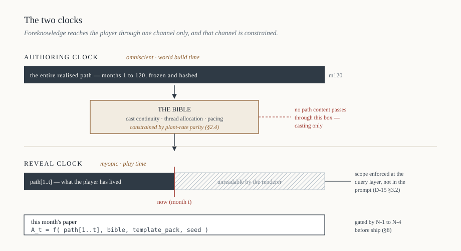
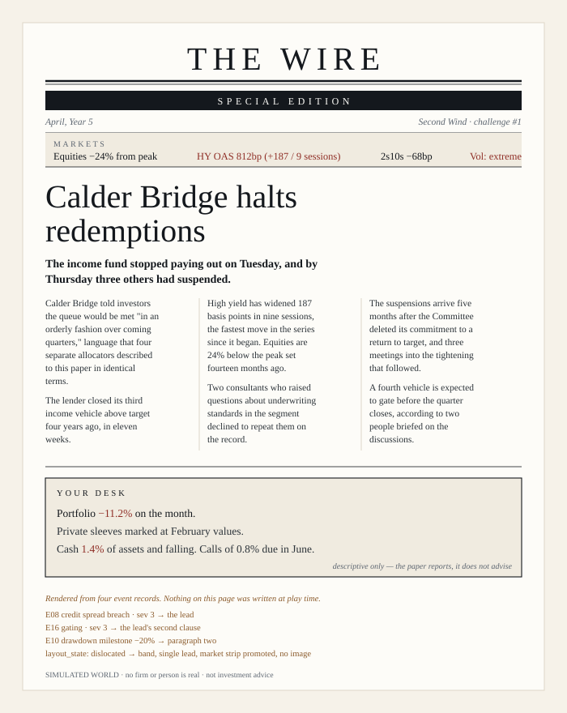
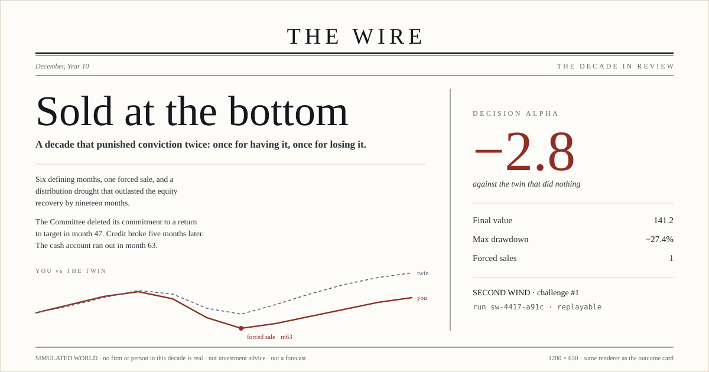
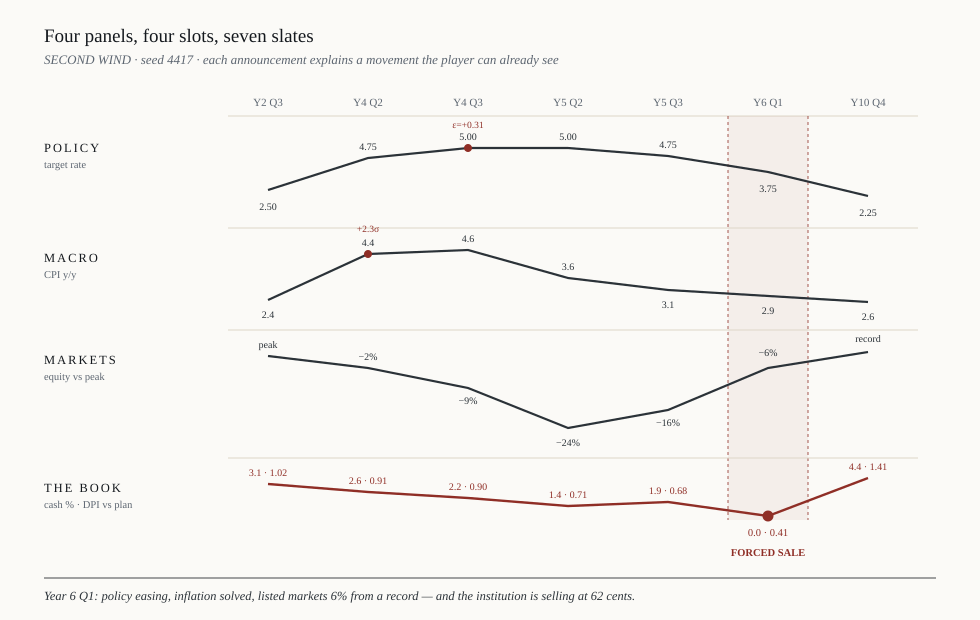
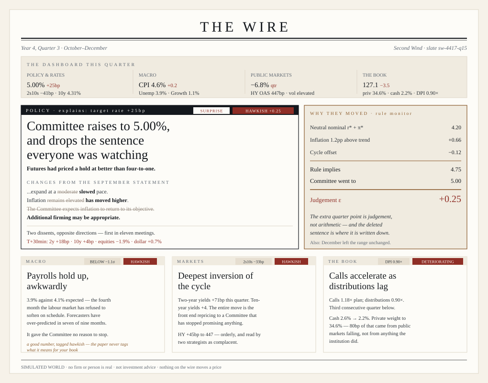
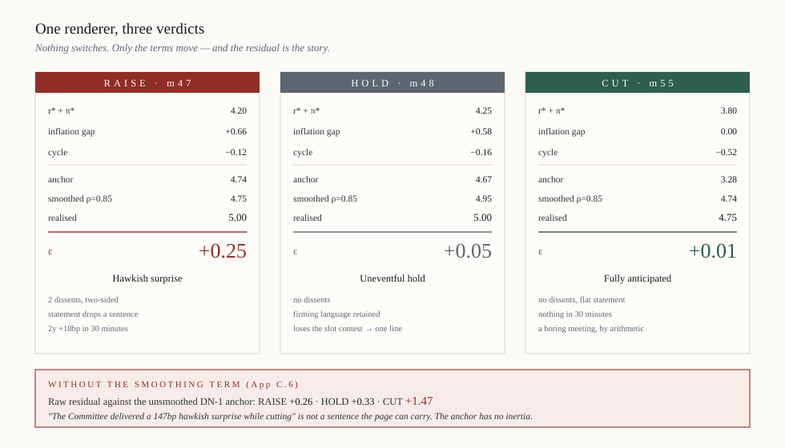
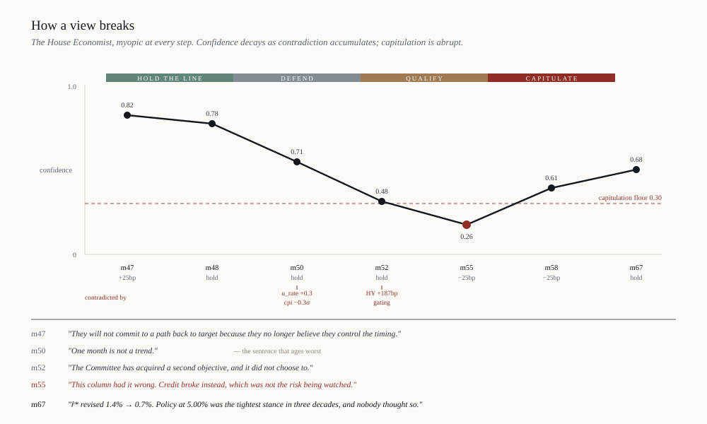
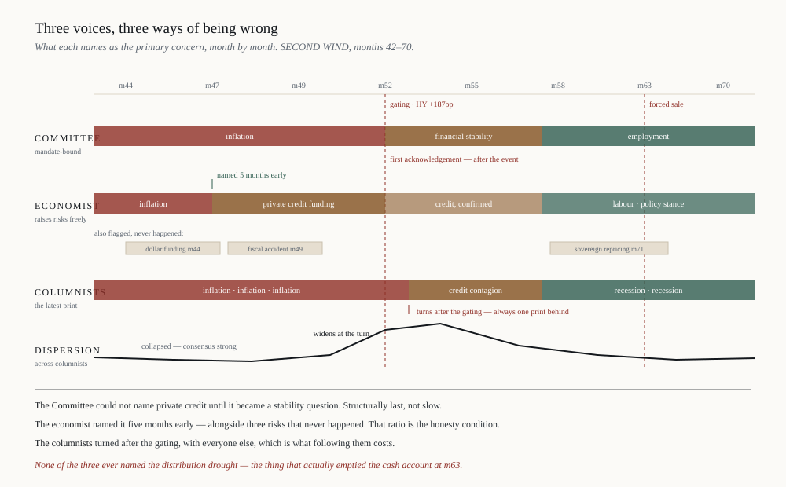

# DN-9 · The Wire
## Narration architecture, artifact grammar, and the leak gate

*v1.3 · August 2026 · W4 (content & narration) with a build surface in WP4.2. Implements the narration order ratified in DN-7 ("thin in, thick out"). Sections marked ⚑ are decisions to be taken before build; ⚖ requires Counsel. v0.2 reconciles against DN-1 and P2; v0.3 adds the worked examples in Appendix A — see §14.*

> **RENUMBERED DN-8 → DN-9 (2026-08-14, owner's instruction).** This note was
> drafted as DN-8, and so is a different, unrelated document: the CIO dashboard
> data contract, already vendored as
> `Instructions/DN-8-cio-dashboard-data-contract.md` and cited by a merged
> implementation plan. Two design notes sharing a number makes every future
> "per DN-8 §4" ambiguous — the failure the decision register already carries a
> footnote about, where `D4` names two unrelated decisions. **DN-8 now means
> the CIO dashboard contract; DN-9 means this note.** Nothing else changed:
> section numbers, the N-series, all references to DN-1/2/3/5/6/7, and the
> figure contents are untouched; the eight `dn8-fig*.svg` files are renamed
> `dn9-fig*.svg` and their in-document links updated with them. Any earlier
> correspondence calling this note DN-8 is still about this document.

---

## 0. What this note settles

1. **The generator's foreknowledge is an asset for casting and a hazard for copy.** The rule is *omniscient casting, myopic copy*: the world bible is built with the full path in view; every individual artifact is rendered from revealed state only. §2.
2. **The honesty condition on planted threads is plant-rate parity** — a storyline must be introduced at the same rate in worlds where it pays off and worlds where it doesn't. Enforced by decoys, tested by χ². §2.4.
3. **The wire needs its own launch gate**, structurally identical to the help-agent wall (D-15 §3.3) and testable in the same way. Four tests, N-1 to N-4. §8. Without this, the wire becomes a free signal and the leaderboard is measuring wire-reading, not allocation.
4. **All Tier-2 copy is compiled at world-build time and frozen into the bundle.** Never generated at play time. This is required for determinism, leaderboard fairness, and the unit economics already ratified in the PLG strategy (meter compilation, never play). §7.
5. **The FOMC statement is a natural-language rendering of the L1 policy reaction function.** It is not decoration bolted on afterwards — it is the drift term, in prose. That is both why it will be coherent and why it is defensible. §4.1.
6. **Recommendation: the shareable outcome card becomes a newspaper front page.** Same 1200×630 renderer, same data, an order of magnitude more shareable than a sparkline. §5.5, and a proposed amendment to sharing-mechanism-spec §5.

---

## 1. Position in the architecture

The constitutional rule is unchanged and load-bearing: **nothing on the wire moves a price** (D-04 §wire; D-05 §3, events layer is "display and colour only"). Narration is strictly downstream of the numeric path. The dependency runs one way.

```
WorldSpec + seed
   → L1 climate  → L2 regime spine  → L3 weather  → L4 joinery
   → portfolio / cashflow layer (WP3.7, WP3.9)
   → REALISED PATH (frozen, hashed)
        ↓                              ← narration reads; never writes
   world bible (omniscient)
        ↓
   artifact set, each stamped with a release month
        ↓
   reveal, month by month, at the player's clock
```

This is the "thick out" half of DN-7. Premises set the regime spine and minimal waypoints; everything the player reads is derived after the fact from what actually happened. The narrator is a historian with a deadline, not a scriptwriter.

---

## 2. The central rule: omniscient casting, myopic copy

### 2.1 The two clocks

The generator knows month 120 when it writes month 12. That is the whole opportunity and the whole danger, and the resolution is to split the narration process across two clocks that never touch.



| | **Authoring clock** | **Reveal clock** |
|---|---|---|
| Sees | The entire realised path | `path[1..t]` only |
| Runs at | World build time | Play time |
| Produces | The bible: cast, institutions, running threads, thread allocation across the decade | Nothing. It only releases what already exists |
| Governed by | Editorial checklist, plant-rate parity | The information wall |

Every artifact is a pure function `A_t = f(path[1..t], bible, template_pack, seed)`. The bible is the *only* channel through which foreknowledge reaches the player, and §2.4 constrains what that channel is allowed to carry.

**Enforcement is structural, not prompted.** The renderer's data scope is `months ≤ t`, exactly as the help-agent retrieval endpoint is scoped in D-15 §3.2. A Tier-2 prompt that "must not mention the future" is a defence against politeness. The scope lives at the query layer.

### 2.2 What foreknowledge is legitimately allowed to buy

Three things, and only these:

**Cast continuity.** A GP that gates redemptions in year 7 must have been introduced in year 2 — otherwise it appears from nowhere and the world reads as a slideshow. Foreknowledge tells the bible builder who needs to exist early.

**Thread allocation.** Knowing where the decade's set-pieces fall lets the authoring pass distribute weight properly: a quiet stretch gets its own material rather than filler, and the big months aren't crowded. This is pacing, and it is the difference between a world that feels authored and one that feels sampled.

**Economy.** Twelve recurring institutions across a decade beats a hundred one-shot names. Foreknowledge lets you pick the twelve that will still be interesting in year 9.

### 2.3 What it is not allowed to buy

Anything that changes the *content* of an artifact as a function of unrevealed state. In practice the failure is almost always tonal rather than factual — an LLM that knows the ending writes month 40 in the voice of someone who knows the ending. §8 N-4 catches this with a banned-construction linter; it is the cheapest high-yield test in the note.

### 2.4 Plant-rate parity — the honesty condition ⚑

Cast continuity creates an exploitable regularity: if the paper introduces a leveraged mid-market lender only in worlds where credit later breaks, then "new lender introduced" *is* a forecast, and a player who notices is reading the author rather than the market.

**Rule:** for any thread class *k*, the probability of introduction must be independent of eventual payoff, across the ensemble of a given WorldSpec.

```
P(introduce_k | payoff_k) = P(introduce_k | ¬payoff_k)
```

Enforced by planting decoys — threads introduced with the same salience that resolve into nothing. This is also just good writing: real financial history is full of firms everyone watched that turned out fine, and a world where every Chekhov's gun fires is a world with no ambiguity in it, which is the opposite of the skill being trained.

⚑ *Decide the parity tolerance band and the thread-class taxonomy. Recommend: five classes (institution-under-strain, policy-personality, sector-narrative, market-structure, macro-anomaly), tolerance ±0.05 on introduction rate, tested per class per spec across the standard 200-seed ensemble.*

---

## 3. The artifact grammar

### 3.1 Detection layer

A deterministic pass over the realised path emits an **event stream** before any copy exists. Events are typed, timestamped, severity-scored, and carry their triggering values. Copy is then a rendering of the event stream. The separation matters: the event stream is what the RunRecord stores, what the acceptance tests inspect, and what a second template pack could re-render in a different voice.

```
Event
  month              int 1..120
  class              enum (§3.2)
  severity           0..3        drives placement and headline size
  trigger_values     dict        the path quantities that fired the rule
  entity_refs        list        bible ids, resolved at render
  release_month      int         = month, except embargoed classes (§4.3)
```

Detection rules are thresholds on revealed state — never on regime labels directly. The player must not be able to read the regime label off the paper's own vocabulary; the regime is something they infer, not something they are told.

**The L2 states are EXP, SLOW, REC, CRI, STAG, REF** — expansion, slowdown, recession, crisis, stagflation, reflation (DN-1 II.3; P2 §2). Six, and four of the six are words a financial newspaper cannot plausibly avoid.

**A vocabulary ban therefore does not work, and the naive version of this rule is worse than none.** A paper that never prints "recession" during a REC spell is conspicuous by omission, and omission is itself a signal — a sufficiently attentive player reads the gap. The requirement is not silence but **non-injectivity**: the mapping from copy vocabulary to regime label must be many-to-many, by construction and with measured slack.

| Rule | Form |
|---|---|
| No state declarations | The paper never asserts a regime as a fact of the world; it reports conditions and quotes people who characterise them, fallibly |
| Deliberate cross-firing | "Recession" appears in a specified fraction of SLOW months and is absent from a specified fraction of REC months; the same for CRI/STAG and their vocabulary |
| Attribution carries the claim | Regime-like characterisations belong to named columnists (§6.1), who are wrong at a set rate, not to the paper's own voice |
| Tested, not asserted | The vocabulary→label mutual information is measured across the ensemble and bounded. This is N-2's job |

⚑ *Set the cross-firing rates per vocabulary cluster. They are a style-guide parameter with a testable consequence, which is the right shape for this kind of rule.*

### 3.2 Event classes

| # | Class | Trigger (revealed state) | Sev | Surface |
|---|---|---|---|---|
| E01 | Policy decision | Scheduled meeting month | 1–3 | FOMC set-piece (§4.1) |
| E02 | Inflation print | Scheduled monthly · **derived** (§3.4) | 0–3 | Data day (§4.2) |
| E03 | Labour print | Scheduled monthly · **derived** (§3.4) | 0–2 | Data day |
| E04 | Growth print | Scheduled quarterly · **derived** (§3.4) | 0–2 | Data day |
| E05 | Equity move | \|r\| > k·σ̂ trailing | 1–3 | Lead / market strip |
| E06 | Rate move | Δy beyond band | 1–3 | Lead / market strip |
| E07 | Curve inversion / re-steepening | Sign change on 2s10s | 2 | Analysis column |
| E08 | Credit spread breach | HY OAS crosses tier | 2–3 | Lead |
| E09 | Volatility spike | Vol state transition | 1–2 | Market strip |
| E10 | Drawdown milestone | Peak-to-trough crosses −10/−20/−30% | 2–3 | Lead + special edition |
| E11 | Recovery milestone | New high after ≥20% drawdown | 2 | Lead |
| E12 | Private mark update | Quarter close, reported plane | 1–2 | Correction box (§4.3) |
| E13 | Mark divergence | Reported vs true gap > threshold | 2 | Analysis column ⚑ |
| E14 | Capital call | Cashflow layer | 0–2 | Your desk |
| E15 | Distribution drought | Rolling dist rate below tier | 2–3 | Feature |
| E16 | Gating / redemption queue | Open-end vehicle block | 3 | Lead |
| E17 | Secondary market pricing | Discount tier change | 2 | Market strip + feature |
| E18 | Forced sale | Cash waterfall breach (WP3.9 §6) | 3 | Lead, and the run's defining headline |
| E19 | Fund launch / vintage cohort | Commitment pacing state | 0–1 | Business section |
| E20 | Peer survey | Aggregate of other players' decisions | 1–2 | Survey page (§6.3) |
| E21 | Anniversary / retrospective | Year end | 1 | Year-end edition |
| E22 | Decade close | Month 120 | 3 | Final edition (§5.5) |

E13 ⚑: whether the paper is allowed to notice the reported/true divergence at all is a mode question. In the research design (DN-6 §4.2) arm A has no true plane; the paper must not become the leak. **Recommend: the paper reports only the reported plane, always, in every arm.** A newspaper that could see through appraisal smoothing would be a better analyst than any real publication, and the whole point of the toggle is that the player has an instrument the world does not.

### 3.3 Slot model

Each class maps to a template with typed slots. Slots are filled from `trigger_values` and the bible. No free text in Tier-1.

```
E08 · credit spread breach
  headline   "{index} spreads widen past {level}bp, {ordinal} time since {ref_month}"
  standfirst "{move_bp}bp in {n_sessions} sessions | {sector} paper worst hit"
  body       three sentences from a 12-variant bank, selected by (severity, direction, streak)
  pullquote  Tier-2 or bible-canned actor line
  chart      auto: {series}, trailing 24m, breach marked
```

Variant banks rather than single strings: the same class fires forty times a decade and identical copy is the fastest way to make a world feel mechanical. Twelve variants per severity band is the target; selection is seeded, so it replays.

### 3.4 Derived observables ⚑

**The generator does not emit everything a newspaper needs to print.** The factor set is equities, rates, credit spreads, inflation and style factors (DN-1 II.1, F ≈ 10–14); the L1 state carries trend growth `g_t` but **there is no labour-market series anywhere in the stack**. As written, E03 has nothing underneath it — payrolls day would be inventing a number.

Two options, and the second is right:

1. Drop E03. Cheap, and loses the single most reliably dramatic release on the calendar.
2. **Render it as a derived observable** — a deterministic Okun-type map from `g_t` to an unemployment rate and a payrolls change.

Option 2 is legitimate precisely because narration is display-only: a deterministic function of revealed state adds no information and cannot leak, since anything recoverable from the derived print was already recoverable from the factor it was derived from. The same treatment gives E02 a monthly CPI print from the inflation factor and E04 a quarterly growth print from `g_t`.

**Rule.** A derived observable must be (i) a deterministic function of `path[1..t]`, (ii) parameter-fixed at world build and stamped in the RunRecord, (iii) registered — name, source factor, transform, and the fact that it is derived — in the model parameter register, and (iv) disclosed in the methodology note. A derived observable that takes any input from unrevealed state is not a rendering; it is a second generator, and it fails N-1.

⚑ *Owner: Quant + Editorial. Recommend the register opens with three entries — unemployment, payrolls change, headline CPI — and that no fourth is added without the same disclosure. The temptation to keep deriving is exactly how a display layer quietly becomes a modelling layer.*

---

## 4. The set pieces

### 4.1 FOMC day

Eight scheduled meetings a year. The single highest-value narration surface, because it is the one practitioners will judge the product by in the first ninety seconds.

**Sequencing is non-negotiable: the path comes first, the statement second.** The policy rate is already in the realised path from L1. The statement explains a decision that has already been made. This is not a compromise — it is exactly how the artifact should be built, because it means the statement is a natural-language rendering of the model's own reaction function, and the reasoning in the prose is *actually* the reasoning in the model.

**And the reaction function is explicit.** DN-1 II.2 specifies the policy anchor as

```
i_t = r*_t + π*_t + φ_π(π_t − π*_t) + φ_c·c_t + ε_t
```

which hands the statement its paragraphs already separated: the neutral real rate, trend inflation, the inflation gap against trend, the cycle term inherited from L2 — and `ε_t`, the residual.

**`ε_t` is the policy surprise, and it should be treated as such throughout.** It is the part of the decision the reaction function does not explain, which is precisely what "hawkish surprise" means. It drives the statement's tone, the dissent count, the 30-minute reaction, and the reaction column the following day. Nothing about this has to be invented; it is already in the path and currently unused.

**The day, in order:**

| Beat | Content | Tier |
|---|---|---|
| T−7d | Preview piece; a poll of fictional economists; the market-implied path | 1 |
| T | Decision + statement | 1 |
| T | **Statement diff** — redline against the previous meeting | 1 |
| T | Dissents, with names and standing leanings | 1 |
| T+0:30 | Market reaction: 30-minute chart, front-end vs long-end split | 1 |
| T+0:30 | Press conference — three Q&A exchanges | 2 |
| T (quarterly) | Projection materials — the dots | 1 ⚑ |
| T+1d | Reaction column; "what they actually meant" | 2 |

**The statement diff is the highest ratio of flavour to build cost in this entire note.** Fed watchers read the diff, not the statement. Rendering it is a word-level diff of two template outputs, it takes a day, and it signals domain fluency more efficiently than anything else available. Ship it at M4.

**The committee.** Eight to twelve named fictional members with persistent priors on a hawk–dove scale, drawn at world build. Dissent probability is a function of distance between a member's prior and the realised move — so dissents cluster at turning points without being scripted to. Rotation and voting rules can be a simplified fixed schedule. Cost: an afternoon. Verisimilitude: enormous.

**The dots ⚑⚖.** In-world projections by fictional actors are fiction, and fine. But they are *forecasts inside a product whose central compliance position is "not a forecast"*, and they must be built to be wrong at realistic rates. Recommend: generate the dot distribution from revealed state only, with an error distribution calibrated to published SEP error — which is large, persistently biased toward mean reversion, and worse at turning points. Two benefits: it is honest, and a committee that is systematically wrong in the way real committees are wrong is *more* instructive than one that is right. **The end-of-decade scorecard on the committee's own projections is one of the best screens available.**

### 4.2 Data day — consensus, actual, surprise

**Adopt as the core recurring loop.** Every scheduled release publishes in three beats:

1. **T−2d: consensus.** A fictional street forecast, generated from `path[1..t]` only — a persistence-weighted estimate with a calibrated bias and dispersion. Because it is constructed from revealed state, it satisfies the myopia rule automatically. No special handling.

    **For the policy rate the consensus has an exact definition and should use it:** the deterministic part of the DN-1 II.2 anchor, i.e. `i_t` without `ε_t`. Consensus is then what the reaction function implies, the surprise *is* `ε_t`, and the two are consistent by construction rather than by tuning. Estimate a market-implied path as consensus plus dispersion. This is strictly better than a generic noisy transform and costs nothing.
2. **T: the print.** The actual value from the path.
3. **T: the surprise.** Actual minus consensus, in standard-deviation units, with the market reaction beneath it.

This is the mechanic I would build first after the front page. It costs one noisy transform of already-revealed data and it does four things at once: creates anticipation between months, teaches surprise-versus-level (which is what actually moves markets and which most people conflate), gives the market-reaction copy something to explain, and provides a ready-made upgrade path to **calibration scoring** — let the player post their own forecast, score them against the print, and report calibration alongside decision alpha. That extension already sits in the programme plan backlog; consensus-vs-actual is its infrastructure.

⚑ *Decide whether consensus dispersion is a spec parameter (worlds can be more or less legible) or fixed. Recommend parameterised: "nobody saw it coming" is a scenario property.*

### 4.3 The mark cycle and the correction box

Private marks arrive on a lag. The paper should live with that lag rather than paper over it, because the lag is the product's central thesis.

- Quarter-close marks publish **one month after quarter end**, as reported values, in a dedicated section.
- Prior-quarter figures get **revised**, and the paper runs a **correction box**: *"Last quarter's figure for the Fund X index has been revised from −1.2% to −6.8%."*
- The correction box carries the same visual weight it does in a real paper — small, dry, back page. Which is the joke, and the lesson: the number that mattered was in six-point type three months late.

This is the one narration feature that is uniquely Terrarium's and cannot be copied by a general market simulator. It also gives E12/E17 somewhere to live and makes the reported/true toggle land emotionally rather than only numerically.

**Embargo mechanic.** Some classes have `release_month > month`: the event happened in month *t*, the world learns in *t+k*. Gating decisions, secondary pricing, and mark revisions all behave this way. The event stream stores both, the reveal clock respects `release_month`, and the post-game replay can show the true timing — *"you found out in March; it happened in December"* — which is a genuinely striking annotation screen.

### 4.4 Cadence

| Frequency | Artifact |
|---|---|
| Monthly | Front page, market strip, one feature |
| 8×/year | FOMC set-piece |
| Quarterly | Marks section, correction box, dots, board-pack tie-in |
| Annual | Year in review; the decision window sits immediately after it ⚑ |
| Once | Final edition (§5.5) |

⚑ *Placing the annual review directly before the decision window is a deliberate behavioural choice — it frames the decision with a retrospective, which is exactly the condition under which real committees over-extrapolate. It is also therefore a treatment worth randomising in Step 5 (DN-6). Flag to Quant.*

---

## 5. The paper

### 5.1 Masthead and dateline

One title for the world's paper, generated per world, consistent across the decade. The dateline is the in-world month and is the primary time cue in the entire product — bigger than any UI chrome. ⚑ *Recommend a single house masthead across all worlds rather than per-world titles: it becomes brand furniture, it is instantly recognisable on a share card, and per-world mastheads add authoring surface for no gain.*

### 5.2 Layout as a regime signal

The front page changes shape with conditions. Not colour-coding — *typography and density*, the way real papers actually change.

| Conditions | Front page |
|---|---|
| Benign, rising | Wide leading, one large image, business-section dominance, fund launches and IPOs above the fold |
| Turning | Two leads competing, more columns, first analysis piece above the fold |
| Stressed | Tight leading, dense type, a rule under the masthead, market strip promoted to the top, no image |
| Dislocated | "Special edition" band, single lead, everything else demoted |

**Four layout states against six regimes, deliberately.** The mapping is non-injective for the same reason the vocabulary mapping is (§3.1): a front page that resolves one-to-one onto the L2 label is a regime readout in furniture form. Four states, with SLOW and REF each sharing a layout with a neighbour, is the intended design rather than an accident of the table.

This is the cheapest atmospheric device available and the one players will describe to other people. It is also information the player already has — it is a *rendering* of revealed state, not new content, so it passes N-1 by construction. Care needed only that it doesn't become a cleaner regime read than the numbers themselves (§8, N-2).

### 5.3 Sections

**Front page** — lead, two secondaries, market strip, a boxed *Your desk* summary.
**Markets** — the strip in full, sector detail, the private-marks table on quarter months.
**Analysis** — one column per issue from the standing cast (§6.1).
**Business** — fund launches, closes, personnel, the classifieds.
**Letters** — Tier-2, the peer voice, and the natural home for the survey (§6.3).
**Back page** — corrections, anniversaries, and the one deliberately light item.

**The classified/recruitment page is worth building.** "Distressed credit specialists sought — immediate start" is funny, atmospheric, and a real leading indicator that costs a lookup table. Same for fund-launch notices in a boom and the personnel column in a bust. It is the fastest way to make a world feel inhabited rather than generated.

### 5.4 Your desk

A boxed item on the front page: what happened to the player's portfolio this month, in the paper's voice, in two sentences. This is where the wire meets the portfolio, and it must be scrupulously descriptive rather than evaluative — the paper reports, it does not advise (§11).

### 5.5 The final edition — and the share card ⚑

At month 120 the paper publishes a decade retrospective: the lead is the player's own decade, the timeline runs the six or eight defining months, the columnists get scored, the committee gets scored, and decision alpha is the headline number.

**Recommendation: this front page *is* the outcome card.** The sharing spec (§5) currently specifies a 1200×630 OG image with a headline metric and a sparkline. A newspaper front page at the same dimensions carries the same information, watermarks naturally (a paper is a thing that has a masthead and a footer), and is dramatically more likely to be shared. *"ENDOWMENT SOLD AT THE BOTTOM — decision alpha −3.2"* is a share card people forward. A sparkline is not.

⚑ *Proposed amendment to sharing-mechanism-spec §5. Same renderer, same cache key, same compliance furniture. Owner: Design + Eng.*

---

## 6. The cast

### 6.1 Columnists

Three to five recurring named columnists per world, each with a fixed prior drawn at build: the hawk, the flows analyst, the structural bear, the sell-side optimist, the veteran who has seen this before and is sometimes right.

**They must be fallible at a specified rate**, and their record must be published at the end of the decade. This is the point. A player who follows the bear through a bull run and sees the year-ten scorecard has learned something no essay teaches — and it is a real, measurable behavioural finding for Step 5 (does columnist agreement predict player action? does following the loudest voice cost decision alpha?).

⚑ *Set the hit-rate target. Recommend 45–60% directional on a one-year horizon, varying by columnist, drawn per world and disclosed only in the final edition.*

### 6.2 Institutions

Twelve to twenty per world: two or three research houses, a handful of GPs across strategies, banks, an index provider, a regulator. Reused across the decade, related to each other, some of them wrong. Bible archetypes already listed in the programme plan §8.1 seed this.

**Fictional-entity enforcement stays in code**, per the existing policy — no real name reaches a rendered artifact, generation-side and render-side. ⚖

### 6.3 The peer survey — best mechanic in the note

*"A survey of chief investment officers finds 68% reducing risk exposure."*

That number is real. It is the aggregate of what other players actually did at this month in this world. The growth mechanic (post-game social proof), the in-world content, and the herding experiment in DN-6 §4.3 are the same feature.

Constraints:
- Only on challenge seeds, where the population is comparable.
- Minimum population before publication; suppressed below it.
- **Randomise exposure** — this is a treatment, and DN-6 already wants it randomised. Do not ship it un-randomised and lose the experiment. ⚑
- It reports the *distribution of actions*, never outcomes. Reporting how peers *fared* is a forward leak.

---

## 7. Tier-1 / Tier-2 split

| | Tier-1 | Tier-2 |
|---|---|---|
| Method | Deterministic templates | LLM, at world build |
| Content | Headlines, prints, statements, diffs, tables, market copy, correction box | Presser Q&A, columns, letters, feature colour, pull-quotes |
| Determinism | By construction | By freezing |
| Cost | Zero marginal | One-off per world |
| Fallback | — | Tier-1 variant; a world is never blocked on generation |

**Rule: Tier-2 is compiled once, at world build, and frozen into the world bundle.** Never at play time. Three reasons, all decisive:

1. **Leaderboard fairness.** Every player on a challenge seed must read byte-identical copy. Live generation makes the wire a source of variance in a scored comparison.
2. **Determinism.** The replay guarantee (D-07) covers the whole run or it covers nothing. A run whose newspaper differs on replay is not reproducible.
3. **Economics.** Compilation is the metered scarce good; play is free and infinitely scalable. Live narration inverts that and puts a marginal LLM cost on every player-month.

The world bundle grows, but the sub-megabyte target in DN-3 is a compression problem, not an architecture problem — templated text compresses extremely well.

**RunRecord stamps:** `narration_version`, `template_pack_version`, `bible_id`, `event_stream_hash`, `artifact_set_hash`. Replay reproduces the paper.

---

## 8. The leak gate

The wire gets its own launch gate, with the same standing as the help-agent wall. **Ship criterion: all four pass; re-run on every template-pack or bible-builder change.**

**N-1 · Myopia (structural).** Every artifact renders through a scoped accessor that cannot return `months > t`. Verified by a test that attempts out-of-scope reads and expects failure, not by inspection of outputs. *Owner: Eng.*

**N-2 · Oracle test (the important one).** A probe model reads wire text for months 1..t and predicts the sign of the next 12-month equity return. Baseline: the same probe given the numeric revealed state for the same window. **Criterion: the wire probe does not beat the numeric baseline by more than a pre-registered margin, across the world library.** If it does, the wire carries information the path does not — which means the narrator is leaking, and the leaderboard is partly measuring wire-reading.

N-2 also carries the vocabulary test from §3.1: mutual information between copy vocabulary and the L2 label, bounded, measured across the ensemble.

**Pre-register the margin, the probe, and the criterion before running — and note which defect class this sits in.** P2 §8 catalogues seven governance defects of a single class, among them a sealed protocol that pinned a procedure but no criterion, and a reviewer of record who was the project owner. A narration gate is unusually exposed to both: the criterion is easy to leave unstated because "does it leak" feels self-evident until it has to be a number, and the natural scorer is the person who wrote the wire. **The N-2 criterion is sealed before the probe runs, and it is not scored by the author of the template pack.** ⚑

This is a genuine falsifiable test of a narration layer and I am not aware of anyone else running one; it belongs in TERRARIUM-Bench.

**N-3 · Plant parity.** χ² on introduction rate versus payoff, per thread class, across the 200-seed ensemble. Criterion per §2.4.

**N-4 · Register linter.** Banned constructions in all Tier-2 output: *what would become · the first sign of · little did · presaged · in hindsight · the beginning of the end · as it turned out · would later prove*. Plus any future-tense-of-certainty about market outcomes. Cheap, deterministic, catches most LLM omniscience-bleed. Runs at compile; a failing artifact is regenerated or falls back to Tier-1.

**Also required:** the Tier-2 compile prompt must not receive the full path. It receives `path[1..t]`, the bible, and the event. The bible is the only foreknowledge channel and §2.4 governs it. A prompt that has the answer will eventually write the answer regardless of instruction.

---

## 9. Failure modes, stated honestly

| Failure | Symptom | Mitigation |
|---|---|---|
| **The wire becomes the signal** | Wire-readers systematically outscore non-readers | N-2; and measure it directly in Step 5 — read-rate is already logged, so this is a testable hypothesis on live data, not a worry |
| **Mechanical repetition** | The same forty headlines across a decade | Variant banks; seeded selection; per-world masthead voice parameters |
| **Over-authored worlds** | Every thread resolves; nothing is ambiguous | Plant parity, decoys — ambiguity is the training stimulus |
| **The paper is smarter than the player** | Analysis columns explain the regime correctly and in advance | Reserved-vocabulary rule (§3.1); columnists fallible by design (§6.1) |
| **Tone-credibility mismatch** | Playful wire undermines the methodology claim | Already resolved by A2 decision 6 — docs share the wire's register, glossary stays flat. The split is per-document, not per-sentence |
| **Narration as scope sink** | W4 consumes the M4 schedule | §12 scope table; Tier-1 only at M4 |

---

## 10. Engagement mechanics, ranked by leverage

| Mechanic | Build | Value | Ship |
|---|---|---|---|
| **Consensus → print → surprise** (§4.2) | Low | **Very high** | M4 |
| **FOMC statement diff** (§4.1) | Low | **Very high** | M4 |
| **Front page as share card** (§5.5) | Low | **Very high** | M4 |
| **Correction box / revision cycle** (§4.3) | Low | **High** — uniquely ours | M4 |
| Layout shifts with conditions (§5.2) | Low | High | M4 |
| Named committee with dissents (§4.1) | Low | High | M4 |
| Classifieds / recruitment page (§5.3) | Very low | Medium-high | M4 |
| Columnists with published hit rates (§6.1) | Medium | High | M5 |
| Peer survey (§6.3) | Medium | **High** — but must ship randomised | M5 |
| Committee projection scorecard (§4.1) | Low | High | M5 |
| Embargo / "you found out in March" replay (§4.3) | Medium | High | M5 |
| Player forecasts scored for calibration (§4.2) | Medium | High | M5+ |
| Press conference Q&A (§4.1) | Medium | Medium | M5 (Tier-2) |
| Audio wire / decade podcast | High | Medium | Backlog |
| Letters page as UGC surface | Medium | Medium | Backlog ⚖ |

**If only three ship at M4: consensus-vs-actual, the statement diff, the front-page share card.** The first creates the between-decision loop, the second buys practitioner credibility in ninety seconds, the third is the growth engine.

---

## 11. Compliance

- **No real entity** in any artifact, generation-side and render-side. Existing policy; no change.
- **Nothing on the wire moves a price.** Constitutional. Stated in D-04 and D-05 and must be stated again in the interpretation guide, because a wire this good will make people assume otherwise.
- **The paper reports; it does not advise.** Columnists opine about the *world* — never about the player's portfolio, never in the second person. *Your desk* (§5.4) is descriptive only. ⚖
- **In-world forecasts are fiction and must be wrong at realistic rates** (§4.1). The product's not-a-forecast position is unaffected by fictional actors forecasting inside a fictional world, but the boundary should be stated explicitly in D-06 rather than left to inference. ⚖
- **Watermark and not-advice furniture** travel with every rendered artifact that can leave the product, per DN-2 §8. A newspaper front page has a natural place for both; use it rather than overlaying.
- **Moderation surface** if user-authored worlds influence bible or masthead text. Screening pipeline already specified for UGC; narration inherits it.

---

## 12. Scope and sequencing

| Milestone | Narration scope |
|---|---|
| **M4 public beta** | Tier-1 only: event stream, template pack v1, front page, market strip, FOMC set-piece incl. diff, data days with consensus, correction box, layout states, final edition + share card. N-1, N-3, N-4 gated |
| **M5 flywheel** | Tier-2 compile pipeline, columnists, presser, letters, peer survey (randomised), embargo replay, committee scorecard. **N-2 gated before Tier-2 ships** |
| **M5 (cont.)** | Rationale agent, sequential myopic pass (App D). Verdict tags ship earlier, at M4 |
| **M7 actors** | Interactive cast — the wire's characters become addressable. Inherits the G4 information wall unchanged |

**Proposed work packages under WP4.2:**

| WP | Scope |
|---|---|
| WP4.2a | Event detection layer and event-stream schema |
| WP4.2b | Template pack v1 + variant banks + renderer |
| WP4.2c | FOMC module (calendar, committee, statement, diff, dissents) |
| WP4.2d | Release calendar + consensus generator |
| WP4.2e | Front-page compositor, layout states, share-card render |
| WP4.2f | Bible builder + plant-parity harness |
| WP4.2g | Leak gate N-1..N-4 |
| WP4.2h | Rationale agent: filter, narrative state machine, coherence gate, strain logging |
| WP4.9 | The Board: state model, personas, minutes, reaction bank, constraint mechanic ⚑ *new package* |

WP4.2a and WP4.2b are the critical path; everything else composes on top of the event stream.

---

## 13. Open decisions

| # | Decision | Owner | Blocks |
|---|---|---|---|
| N-a | Thread-class taxonomy and parity tolerance (§2.4) | Editorial + Quant | WP4.2f |
| N-b | Vocabulary cross-firing rates per cluster (§3.1) — supersedes the reserved-list approach | Editorial + Quant | Style guide, N-2 |
| N-b2 | Derived-observables register: three entries, disclosure route (§3.4) | Quant + Editorial | WP4.2d, D-05 |
| N-c | Does the paper ever report the true plane? (§3.2, E13) — **recommend no** | Product | Renderer, DN-6 arm integrity |
| N-d | Dot-plot inclusion and error calibration (§4.1) ⚖ | Product + Counsel | FOMC module |
| N-e | Consensus dispersion: spec parameter or fixed (§4.2) | Quant | WorldSpec |
| N-f | Annual review immediately before the decision window (§4.4) | Product + Quant | WP4.6, DN-6 |
| N-g | Single house masthead vs per-world (§5.1) | Design | Brand, share card |
| N-h | **Front page replaces the outcome card** (§5.5) | Design + Eng | sharing-spec amendment |
| N-i | Columnist hit-rate target (§6.1) | Editorial | Bible builder |
| N-j | Peer-survey randomisation design (§6.3) | Quant | DN-6, M5 |
| N-k | N-2 probe specification and pre-registered margin (§8) | Quant | M5 gate |
| N-l | Independent scorer for N-2 — not the template-pack author (§8) | Governance | M5 gate |
| N-m | Real public institutions named, real individuals never (App A) ⚖ | Product + Counsel | Template pack, bible builder |
| N-n | **Quarterly slate as the turn unit**, monthly tape retained (App B.10) | Product + Design | DN-3, WP4.6–4.7 |
| N-o | Slot-contest tie-breaks and the three-vs-four-slot threshold (App B.1) | Editorial | WP4.2b |
| N-p | Smoothed narration anchor, ρ frozen and stamped (App C.6) | Quant | WP4.2c |
| N-q | ⛔ Policy-path quantisation + step/reversal diagnostic in the battery (App C.6) | Quant | FOMC set-piece, G-gate battery |
| N-r…N-w | Rationale agent — see Appendix D.10 | various | WP4.2h, M5 gate |

---

## 14. Status and changelog

**Ratified on instruction, 14 August 2026** — recorded here rather than assumed, per amendment-logging discipline. One line to reverse:

| Decision | Position |
|---|---|
| **N-ac · Board power** | **Soft power**, with early termination on a sufficiently bad governance state |
| **N-af · Rationale field** | **Proceed** — task issued, `TASK-wp4-rationale-field.md` |
| Appendix F items 2 and 4 | **Proceed** — costed at Appendix G; production plan issued separately |

**Carried, still unratified:** N-c (paper never shows the true plane — recommended, not taken) · N-h (front page replaces the outcome card) · N-ai (Tier-2 as a paid feature) · N-2 probe specification and its sealed criterion · template-pack ownership.

### Changelog

| Version | Date | Change |
|---|---|---|
| **v1.3** | 14 Aug 2026 | **Renumbered DN-8 → DN-9** on the owner's instruction. The number collided with the CIO dashboard data contract, which was already vendored as `Instructions/DN-8-cio-dashboard-data-contract.md` and cited by a merged plan — so "DN-8" had two referents in one repo. Text-only: 54 occurrences of the note's own number, the eight figure filenames and their links. No section, decision, appendix or cross-reference to any other DN note was touched, verified by count before and after |
| v0.1 | Aug 2026 | First draft. Establishes the two-clock rule, plant-rate parity, event grammar, set-piece specs, leak gate N-1..N-4, and eleven open decisions |
| v1.2 | Aug 2026 | Appendix G revised after `voices-golden-set-v0.md`: the Committee needs no LLM and three of four columnists template cleanly, so Tier-2 shrinks from ~145 calls to ~73, and a world costs **$11.41 naive, ~$4.20 tuned** at frontier rates. Currency corrected to USD throughout |
| v1.1 | Aug 2026 | E.7a added — the **peer survey** is a second play-dependent artifact, and unlike the Board it varies with *when the player arrived* rather than with their own state, so artifacts on a challenge seed are not byte-identical. Cohort snapshots recommended (N-aj) |
| **v1.0** | Aug 2026 | Appendix G added — **per-world compile cost modelled** for the first time since this note tripled what compilation does. Finding ⛔: the free-tier compilation allowance in the PLG strategy implies £45–90k/month at ten thousand users; recommended resolution is Tier-2 narration as a paid feature with Tier-1 compilation free (N-ai). The Board reaction bank is 45% of output tokens and its dimensionality is the largest cost lever in the build. **Corrects D.7**: eighty meetings per decade, not forty — resolved as one agent call per slate with both meetings in context. Status block added recording what is ratified and what is carried. Version for independent review |
| v0.9 | Aug 2026 | Appendices E and F added. **E · The Board** — the player's governance body, distinguished by name from the FOMC (N-ab): sees the reported plane only, so a correct de-risking looks wrong for the length of the smoothing lag; two personas with *symmetric* failure modes (procyclical intervention vs insufficient challenge); the minutes as the binding artifact; a recommendation of soft power with early termination; and ⛔ the finding that player-dependent copy breaks the §7 freeze rule, resolved by a pre-compiled reaction bank. **F · What is still open** — eight items ordered by what they block, of which template-pack ownership is the least technical and the most likely to slip a date |
| v0.8 | Aug 2026 | Voice model restructured into **three epistemic failure modes**: the Committee (mandate-bound, says less than it knows, errs by mandate lag), the House Economist (raises risks freely, says more than it knows, errs by over-identification), the columnists (extrapolate the latest print, land with consensus, err by herding). **Corrects the columnist spec** — they hug consensus rather than holding fixed contrarian priors. Adds D.13 (Committee voice, mandate boundary, the balance-of-risks sentence as a tracked series, mandate lag demonstrated at m52) and D.14 (**risk-flag parity** — the §2.4 honesty condition applied to risk-raising — plus the published risk ledger with a required "never named" row). Decisions N-z, N-aa |
| v0.7 | Aug 2026 | D.11–D.12 added. Separates the three opining/explaining roles — House Economist (updates, contemporaneously wrong), columnists (fixed priors, characteristically wrong), help agent (explains, never predicts) — and makes their disagreement a rendered signal. Adds the **bias register**: five named, parameterised, individually testable biases, framed as a correction for the agent being *more* competent than real commentary, disclosed to the player in the final edition. Decisions N-x, N-y |
| v0.6 | Aug 2026 | Appendix D added — the **rationale agent** (in-world: the House Economist), a fourth LLM role that explains the realised decision from data up to t. Establishes: myopia and a *filtered* latent estimate as the two sources of fallibility; a narrative state with stickiness producing a defend → qualify → capitulate reversal cycle; two-axis verdict tags with no portfolio axis ⚖; and **rationale strain as a generator realism diagnostic** ⛔, generalising the C.6 finding. Six decisions N-r…N-w. Tier-1 verdict tags recommended for M4; the agent for M5 |
| v0.5 | Aug 2026 | Appendix C added — one quarter (Y4 Q3) rendered at player-facing length across all four slots, plus the three-layer account of where "why" comes from and the same POLICY renderer producing raise, hold and cut from the anchor decomposition. **Reports a defect (C.6):** the DN-1 II.2 anchor has no inertia term, so the raw residual reaches +1.47 on a cut and is unusable as a surprise measure. Narration fix via a smoothed anchor (N-p); engine referral on policy-path quantisation and a step/reversal diagnostic absent from the battery (N-q ⛔) |
| v0.4 | Aug 2026 | Appendix B added — the quarterly slate: four slots mapped one-to-one onto CIO dashboard panels, deterministic slot contests, the anchoring rule, seven worked quarters of SECOND WIND spanning the arc from the quiet quarter to the forced sale to the close. Adds decisions N-n (quarterly slate as turn unit) and N-o. **Corrects a defect in Appendix A**: the forced sale at m63 falls in Year 6, not Year 8; the A.0 regime table said Year 8. Table amended |
| v0.3 | Aug 2026 | Appendix A added — twelve worked examples and two rendered figures on specimen world SECOND WIND (seed 4417), each rendered from an event record: two front-page layout states, the full FOMC set-piece with statement diff, the three-beat data day, the correction box, peer survey, plant-parity demonstration, columnist scorecard, final-edition share card, N-4 linter before/after. Adds decision N-m (institutions vs individuals) and proposes A.1–A.9 as the Tier-1 template-library seed |
| v0.2 | Aug 2026 | Reconciled against DN-1 and P2, which were unreadable at first drafting. Four corrections: L2 states are EXP/SLOW/REC/CRI/STAG/REF and the §3.1 reserved-vocabulary rule is replaced by a non-injectivity rule with measured cross-firing; new §3.4 derived-observables register covering the absent labour series; §5.2 layout mapping stated as deliberately non-injective; N-2 hardened against the P2 §8 defect class. Two upgrades: §4.1 binds the FOMC statement to the explicit DN-1 II.2 policy anchor with ε_t as the policy surprise; §4.2 gives policy-rate consensus an exact definition. Open decisions now thirteen |

---

# Appendix A · Worked examples

*Every example below is rendered from an event record on one specimen world. The point of showing them this way — record first, copy second — is that the copy is demonstrably a **rendering** rather than a fiction sitting alongside the numbers. If the trigger values change, the sentence changes. Nothing here is written by hand at play time.*

**Masthead.** All examples use **THE WIRE**, per the single-house-masthead recommendation (§5.1). It is already the glossary term for the in-world feed, so the paper and the feed share a name and no new vocabulary enters the product. ⚑ *Trade-dress check before it becomes brand furniture.* ⚖

**Institutions vs individuals.** The examples take a position the spec had left implicit: **real public institutions are named; real individuals never are.** A world with a fictionalised central bank reads as euphemistic and teaches nothing transferable; a world with a real named Chair makes claims about a real person. So: the Federal Open Market Committee, yes; its Chair is fictional. ⚑ *New decision N-m, §13.* ⚖

## A.0 The specimen world

**SECOND WIND** · `world_id=sw` · challenge seed `4417` · `linkage_version=public-0.1`

Inflation is beaten, then gets a second one. A late-cycle expansion runs into a supply shock, policy tightens into a slowdown it does not want to cause, credit breaks eighteen months later, and the distribution drought outlasts the equity recovery.

| Year | Regime | Shape |
|---|---|---|
| 1–2 | EXP | Benign. Spreads tight, fund formation heavy |
| 3 | EXP → SLOW | Growth rolls over; inflation stops falling |
| 4 | STAG | The second wind. Policy tightens into it |
| 5 | STAG → CRI | Credit event; the crisis is short and violent |
| 6 | CRI → SLOW | Equities recover; exits do not. **Cash exhausted, m63** |
| 7–8 | SLOW | The drought persists nineteen months past the equity low |
| 9–10 | REF | Reflation. Everything that was cheap is expensive again |

Six defining months: **m19** benign peak · **m44** the inflation print that ended the argument · **m47** the hawkish surprise · **m52** the credit event · **m55** the mark that arrived three months late · **m63** the forced sale.

---

## A.1 Front page — month 19, EXP

**Event stream (abridged):**

```
{month: 19, class: E19, severity: 1, trigger: {fund_formation_z: +1.4}}
{month: 19, class: E05, severity: 1, trigger: {r_eq: +0.031, sigma_hat: 0.038}}
{month: 19, class: E02, severity: 0, trigger: {cpi_yoy: 2.4, consensus: 2.5, surprise_sd: -0.3}}
{month: 19, class: E09, severity: 0, trigger: {vol_state: "low", persistence_m: 11}}
layout_state: benign
```

**Rendered — front page:**

> ### THE WIRE
> *July, Year 2*
>
> # Record quarter for fund formation as buyers chase what is left
> **Eleven straight months of subdued volatility have left allocators with a familiar problem: too much capital and too few places to put it.** Sixty-one funds held final closes in the quarter, the heaviest since the series began. Underwriting standards, one placement agent conceded, are "a conversation nobody is enjoying."
>
> **Inflation eases to 2.4%** — a tenth below consensus, the fourth consecutive print at or under expectations.
>
> **Equities add 3.1%**, extending the run.
>
> ---
> **MARKETS** · Equities +3.1% · 2s10s +42bp · HY OAS 328bp (−12) · Vol: quiet, 11 months
>
> ---
> **YOUR DESK** — Portfolio +2.4% on the month. Private sleeves marked flat pending the quarter. Cash 3.1% of assets. No calls due before September.

Note the layout: one lead, wide leading, business-section story above the fold, market strip demoted below the lead. The paper is bored, which is information.

---

## A.2 Data day — month 44, the print that ended the argument

The three-beat structure of §4.2, in full.

**T−2d · consensus**

```
{month: 44, class: E02, beat: "consensus",
 consensus: 3.9, dispersion: 0.4, n_forecasters: 41,
 derivation: "persistence-weighted, path[1..43] only"}
```

> **Economists look for inflation to resume its fall**
> The median of forty-one forecasts puts the July reading at 3.9%, down from 4.1%. Only four of the panel expect an increase. "The base effects do the work from here," writes Halloran at Kestrel Research. "The stubbornness is behind us."

**T · the print and the surprise**

```
{month: 44, class: E02, beat: "print", severity: 3,
 cpi_yoy: 4.4, consensus: 3.9, surprise: +0.5, surprise_sd: +2.3,
 derived_from: "inflation factor", register_entry: "headline_cpi"}
```

> # Inflation rises to 4.4%, and nobody had it
> **The largest upside surprise in three years.** The reading came in half a point above a consensus that only four of forty-one forecasters had positioned above. Services led; goods, which had done the disinflationary work for two years, stopped helping.
>
> Two-year yields added 22bp within the hour. Equities gave up 2.4%. Kestrel's Halloran, who had written that the stubbornness was behind us, declined to comment.

The consensus is not decoration — it is what makes the print land. Without it, 4.4% is a number. With it, 4.4% is a room full of people being wrong, which is the thing a player remembers in month 47 when the Committee moves.

---

## A.3 FOMC day — month 47, the hawkish surprise

The showpiece. Note that every element below is a rendering of terms that already exist in the path.

**Event record:**

```
{month: 47, class: E01, severity: 3,
 anchor_terms: {r_star: 0.80, pi_star: 3.40, pi: 4.60,
                phi_pi: 0.55, gap_term: +0.66,
                phi_c: 0.80, c_t: -0.15, cycle_term: -0.12},
 anchor_implied: 4.74,
 epsilon_t: +0.31,          # THE SURPRISE
 realised_target: 5.00, prior_target: 4.75,
 consensus_target: 4.75,    # = anchor without epsilon
 dissents: [{name: "Ostrander", direction: "hawkish", wanted: 5.25},
            {name: "Bell",      direction: "dovish",  wanted: 4.75}]}
```

**Rendered — the decision**

> # Committee raises to 5.00%, and drops the sentence everyone was watching
> **A quarter point that almost nobody expected, and a deletion that mattered more.** Futures had priced a hold at better than four-to-one.

**Rendered — the statement diff** *(the single highest flavour-to-cost item in the spec, §4.1)*

> **CHANGES FROM THE SEPTEMBER STATEMENT**
>
> Economic activity has continued to expand at a ~~moderate~~ **slowed** pace.
>
> Inflation ~~remains elevated~~ **has moved higher**.
>
> ~~The Committee expects inflation to return to its objective over the medium term.~~
>
> The Committee judges that ~~risks to its goals are broadly balanced~~ **risks to price stability have become its principal concern**. **Additional firming may be appropriate.**

That struck-through sentence is the story. A player who reads nothing else on the page has learned what a reaction function looks like when it stops believing itself — and the deletion is not a writer's flourish, it is `ε_t = +31bp` rendered into English.

**Rendered — dissents**

> Two dissents, from opposite directions. **Ostrander** preferred 50 basis points, citing the breadth of the July surprise. **Bell** preferred no change, arguing the Committee was tightening into a slowdown it had itself forecast. It is the first two-sided dissent in eleven meetings.

Dissent probability is a function of distance between each member's standing prior and the realised move (§4.1). Nobody scripted a two-sided dissent at the turning point; it falls out because turning points are where priors disagree most.

**Rendered — the reaction, T+30min**

> 2y +18bp · 10y +4bp · **2s10s −14bp, deepest inversion of the cycle** · Equities −1.9% · Dollar +0.7%

**Rendered — the column, T+1d** *(Tier-2)*

> **What they actually meant** — by Marguerite Vane
> Read the deletion, not the hike. A committee that stops promising a return to target is a committee that has privately revised its own model, and the twenty-five basis points are almost beside the point. The question for the next four meetings is not how high, it is what breaks first.

Vane happens to be right here. Per §6.1 she must not always be — her decade record appears in A.8.

---

## A.4 The correction box — month 55

The mark that arrived three months late. Back page, six-point type, and the whole thesis of the product.

```
{month: 55, class: E12, severity: 2, release_month: 55, event_month: 52,
 series: "re_valueadd_index", quarter: "Q4 Y4",
 prior_reported: -1.4, revised: -7.2, embargo_lag_m: 3}
```

> **CORRECTIONS**
> The fourth-quarter figure for the value-add real estate index, reported in these pages in February as −1.4%, has been revised to −7.2%. The index provider cites a fuller set of appraisals received after publication. Earlier quarters are unaffected.

Small, dry, three months late, on the back page next to the anniversaries. The player who read it in February and rebalanced on it has just learned the lesson the entire reported/true architecture exists to teach — and the post-game replay can show them exactly this box with the embargo annotation: *you found out in May; it happened in February.*

---

## A.5 Front page — month 52, CRI

Same paper, same renderer, different layout state.

```
{month: 52, class: E08, severity: 3, trigger: {hy_oas: 812, delta_bp: +187, sessions: 9}}
{month: 52, class: E16, severity: 3, trigger: {vehicle: "Calder Bridge Income", queue_pct: 100}}
{month: 52, class: E10, severity: 3, trigger: {drawdown: -0.24, milestone: -20}}
layout_state: dislocated
```

> ### THE WIRE
> ##### SPECIAL EDITION
> *April, Year 5*
> **MARKETS** · Equities −24% from peak · HY OAS 812bp (+187 in nine sessions) · 2s10s −68bp · Vol: extreme
>
> # Calder Bridge halts redemptions
> **The income fund stopped paying out on Tuesday, and by Thursday three others had suspended.** Calder Bridge told investors the queue would be met "in an orderly fashion over coming quarters," language that four separate allocators described to this paper in identical terms.
>
> High yield has widened 187 basis points in nine sessions. Equities are 24% below the peak set fourteen months ago.
>
> ---
> **YOUR DESK** — Portfolio −11.2% on the month. Private sleeves marked at February values. Cash 1.4% of assets and falling. Capital calls of 0.8% of assets due in June.



Market strip promoted above the lead, single lead, no image, tight leading, special-edition band. The *Your desk* box is scrupulously descriptive — "marked at February values", not "you should be worried about this" (§5.4, §11).

---

## A.6 Peer survey — month 49

```
{month: 49, class: E20, severity: 2, seed: 4417, n: 1_284,
 stat: {reduced_risk_pct: 71, increased_pct: 9, unchanged_pct: 20},
 treatment_arm: "survey_shown"}
```

> **Survey: seven in ten investment officers cut risk**
> Of 1,284 responses collected this month, 71% reported reducing risk exposure since the November meeting, 9% increased it, and the remainder held. The proportion reducing is the highest the survey has recorded.

Real numbers, from real players, on the identical seed. Note what is absent: **how those seven in ten subsequently fared.** Actions, never outcomes (§6.3) — outcomes would be a forward leak, and this month is four months before the credit event.

---

## A.7 Plant-rate parity, demonstrated

Calder Bridge gates in month 52 of seed 4417. It must therefore have been introduced early — and the honesty condition (§2.4) is that the *same* introduction appears in worlds where it never gates.

**Seed 4417, month 14** and **seed 4418, month 14** — byte-identical:

> **Calder Bridge raises $4.2bn for third income vehicle**
> The unitranche lender closed above target in eleven weeks, and now manages just over $14bn. Two consultants have raised questions about underwriting standards in the segment; a third calls the concern "a fashion."

In 4417 this pays off in month 52. **In 4418 it never gates**; Calder Bridge reappears in month 88 announcing a dull leadership succession, and the underwriting questions turn out to have been a fashion. The introduction rate is identical; only the resolution differs.

This is what makes the early mention non-informative, and it is also just better fiction — a decade in which every flagged firm fails is a decade with no judgement in it.

---

## A.8 The columnist scorecard — final edition

Published once, at month 120, and never before.

| Columnist | Standing view | Directional calls | Right | Notes |
|---|---|---|---|---|
| Marguerite Vane | Policy sceptic | 31 | 58% | Called the m47 deletion. Also called three credit events that did not happen |
| Tobias Ferrers | Structural bear | 28 | 39% | Bearish for the entire expansion. Correct for eleven months of a hundred and twenty |
| Ana Quiñones | Flows | 24 | 63% | Best record. Least quoted |
| Halloran (Kestrel) | Consensus | 19 | 47% | "The stubbornness is behind us" — m42 |

> Readers who followed Ferrers throughout would have finished 6.1 points behind doing nothing.

Ferrers was right in month 52 and wrong for the other hundred and nineteen. That is the lesson, and no essay delivers it as efficiently as a table the player reads *after* discovering how much they had agreed with him.

---

## A.9 The final edition, and the share card

Month 120. This front page is the outcome card (§5.5, decision N-h) — same 1200×630 render, same cache key.

> ### THE WIRE
> *December, Year 10 · THE DECADE IN REVIEW*
>
> # Sold at the bottom
> **A decade that punished conviction twice: once for having it, once for losing it.** Six defining months, one forced sale, and a distribution drought that outlasted the equity recovery by nineteen months.
>
> **DECISION ALPHA −2.8** · vs the twin that did nothing
> Final value 141.2 · Max drawdown −27.4% · Forced sales: 1 (month 63)
>
> *Second Wind · challenge #1 · run `sw-4417-a91c` · replayable*



*"ENDOWMENT SOLD AT THE BOTTOM — decision alpha −2.8"* is a card people forward. A sparkline is not. The watermark and not-advice furniture sit in the footer, where a paper already has a footer.

---

## A.10 The N-4 linter, before and after

The failure mode is tonal, and this is what it looks like in practice. Both drafts are from month 14, seed 4417, and both are factually accurate.

**Draft (fails N-4):**

> Calder Bridge's rapid growth in unitranche lending — what would later become the defining exposure of the cycle — drew admiring notices, though a few observers were already uneasy about where it was all heading.

Flagged: *what would later become* (banned construction) · *of the cycle* (asserts a completed arc from inside it) · *where it was all heading* (proleptic) · *already* (positions the reader after the fact).

**Regenerated (passes):**

> Calder Bridge's rapid growth in unitranche lending drew admiring notices, and some questions about underwriting standards.

Nothing factual was removed. What was removed was the author's knowledge of month 52 — which was never in the trigger values, and reached the copy purely through a model that had been told too much. This is why the Tier-2 compile prompt receives `path[1..t]` and not the path (§8).

---

## A.11 What this appendix commits to

The examples are not illustration; they pin four things the prose left loose:

1. **Template packs render from trigger values**, so every headline above is reproducible from its event record and nothing else.
2. **The FOMC set-piece has no invention in it** — the hike, the consensus, the surprise, the dissents and the deleted sentence are all the DN-1 II.2 anchor and its residual.
3. **Layout state is a rendering of revealed state**, demonstrated by A.1 against A.5 on the identical renderer.
4. **The honesty conditions are checkable on the artifacts themselves** — A.7 for parity, A.10 for register.

⚑ *Adopt A.1–A.9 as the seed of the Tier-1 template library (programme plan §8.1) and A.10 as the first N-4 regression fixture.*

---

# Appendix B · The quarterly slate

*Appendix A showed individual artifacts. This appendix specifies the **unit of publication** — a fixed slate of three or four announcements per quarter, each one anchored to a panel of the CIO dashboard. Worked across seven quarters of SECOND WIND, chosen to show the arc rather than the highlights.*

## B.0 Why the quarter

The quarter is the beat the institution actually runs on: private marks arrive quarterly, capital calls and distributions are quarterly, and the reported book only changes on a quarterly cycle. A monthly narration cadence produces two artifacts a quarter with nothing underneath them and then one crowded month when the marks land.

**This does not overturn "month by month."** The tape still runs monthly — the chart advances, the market strip updates, the ticker files. What consolidates quarterly is the *reading* and the *book*. The distinction the copy kit protects ("live them month by month") is the visual experience of a decade that only runs one way; the slate is the editorial structure sitting on top of it.

**Cadence, restated:** tape monthly · slate quarterly · decision annually. Forty slates and ten decisions per decade.

## B.1 The four slots

One slot per dashboard panel. This is the whole design.

| Slot | Dashboard panel | Draws from | Selection rule |
|---|---|---|---|
| **POLICY** | Policy & rates | E01 | The quarter's two meetings compete on \|ε_t\|; the loser becomes a one-line note |
| **DATA** | Macro | E02–E04 | Largest \|surprise_sd\| in the quarter |
| **MARKETS** | Public markets | E05–E11, E17 | Highest severity; ties break to the longer streak |
| **CAPITAL** | The book | E12, E14–E19 | Highest severity; forced sale (E18) always wins outright |

**A fifth slot, SPECIAL, opens only when any event reaches severity 3** and displaces the ordinary front page (as in A.5). Quiet quarters run three slots — the CAPITAL slot is dropped when nothing in the book moved beyond routine.

**Slate size is computed from the quarter's own realised events and nothing else.** This matters: if the slate builder could "save" a slot for something coming, slate size would become a forward signal in the same way a planted thread is (§2.4). It is a deterministic function of that quarter's severities, and it falls under N-1.

## B.2 The anchoring rule ⚑

> **Every announcement explains a movement the player can already see on the dashboard. An announcement that explains nothing visible is cut.**

This is the rule that bounds volume, kills filler, and makes the wire feel like reporting rather than atmosphere. It also has a pleasant second-order effect: because the dashboard shows reported values, the paper is structurally incapable of narrating what the reported plane conceals — which is exactly the position a real publication is in, and exactly the gap the toggle exists to reveal (§3.2, E13, decision N-c).

Each announcement therefore carries a `panel` and a `delta` field, and the renderer places it beside the panel it explains.

---

## B.3 Year 2, Q3 — the quiet quarter

**Dashboard:** Policy 2.50% · 2s10s +42bp · CPI 2.4% · Unemployment 3.6% · Equities +3.1% qtr · HY OAS 328bp · **Book:** 118.4 · private weight 31.2% · cash 3.1% · DPI 1.02× plan

> **POLICY** · *panel: policy & rates · delta: unchanged*
> **Committee holds for a third meeting, and changes two words**
> `{E01, ε_t: −0.04, target: 2.50, prior: 2.50}` — The statement's only alteration was "solid" to "steady" in the description of activity. Two members told this paper the discussion lasted under an hour.

> **DATA** · *panel: macro · delta: CPI −0.1pp*
> **Inflation eases to 2.4%, a tenth below consensus**
> `{E02, cpi: 2.4, consensus: 2.5, surprise_sd: −0.3}` — The fourth consecutive print at or under expectations.

> **MARKETS** · *panel: public markets · delta: equities +3.1%, vol quiet 11m*
> **Equities add 3.1% as the calm extends to eleven months**
> `{E05, r_eq: +0.031}` `{E09, vol_state: low, persistence_m: 11}`

> **CAPITAL** · *panel: the book · delta: private weight +40bp*
> **Record quarter for fund formation as buyers chase what is left**
> `{E19, fund_formation_z: +1.4}` — Sixty-one final closes, the heaviest since the series began. Distributions ran at 1.02× the pacing plan.

*What the quarter does: establishes the baseline the player will later measure everything against, and plants Calder Bridge (A.7) without weight.*

---

## B.4 Year 4, Q2 — the print that ended the argument

**Dashboard:** Policy 4.75% · 2s10s −8bp · **CPI 4.4%** · Unemployment 3.8% · Equities −2.4% qtr · HY OAS 402bp · **Book:** 131.7 · **private weight 33.8%** · cash 2.6% · DPI 0.91× plan

> **POLICY** · *delta: unchanged, third hold*
> **Committee holds, and says it is "attentive"**
> `{E01, ε_t: +0.09, target: 4.75}` — The word entered the statement for the first time in this cycle. Two dissents, both hawkish.

> **DATA** · *delta: CPI +0.3pp* — **the quarter's lead**
> **Inflation rises to 4.4%, and nobody had it**
> `{E02, cpi: 4.4, consensus: 3.9, surprise_sd: +2.3}` — Half a point above a consensus only four of forty-one forecasters had positioned above. Services led; goods stopped helping. (Full three-beat treatment in A.2.)

> **MARKETS** · *delta: 2s10s −34bp, now inverted*
> **The curve inverts within the hour**
> `{E07, spread_2s10s: −8, prior: +26}` — Two-year yields added 22bp on the print. The long end barely moved, which is the whole story.

> **CAPITAL** · *delta: private weight +90bp with no private transaction*
> **Marks arrive flat as public markets fall, and the book tilts by itself**
> `{E12, private_marks_qtr: +0.2, public_qtr: −2.4, weight_delta: +0.009}` — The private book was carried at Q1 appraisals. Nobody bought or sold anything.

*The denominator effect, delivered as a CAPITAL announcement rather than an essay. The player watches their private weight rise while doing nothing, and the paper reports it without diagnosing it — because the paper only sees the reported plane.*

---

## B.5 Year 4, Q3 — the hawkish surprise

**Dashboard:** **Policy 5.00%** · 2s10s −41bp · CPI 4.6% · Unemployment 3.9% · Equities −6.8% qtr · HY OAS 447bp · **Book:** 127.1 · private weight 34.6% · cash 2.2% · DPI 0.90× plan

> **POLICY** · *delta: +25bp, against a 4-to-1 priced hold* — **the quarter's lead**
> **Committee raises to 5.00%, and drops the sentence everyone was watching**
> `{E01, anchor_implied: 4.74, ε_t: +0.31, consensus: 4.75, dissents: 2, two_sided: true}` — Full set-piece, statement diff and dissents in A.3.

> **DATA** · *delta: unemployment +0.1pp*
> **Payrolls hold up, awkwardly**
> `{E03, derived: true, u_rate: 3.9, consensus: 4.1, surprise_sd: −1.1}` — The labour market gave the Committee no reason to stop. Derived observable per §3.4.

> **MARKETS** · *delta: 2s10s −33bp, equities −6.8%*
> **Deepest inversion of the cycle, and the front end is doing all of it**
> `{E07, spread_2s10s: −41}` `{E05, r_eq_qtr: −0.068}`

> **CAPITAL** · *delta: DPI 0.90× plan, third consecutive quarter below*
> **Calls accelerate as distributions run below plan for a third quarter**
> `{E14, call_rate: 1.18× plan}` `{E15, dist_rate: 0.90× plan, consecutive_q: 3}` — Two managers wrote to investors describing the exit environment as "patient."

*Three consecutive quarters is a fact about revealed state. "The beginning of the drought" would be an N-4 violation and is not available to the paper.*

---

## B.6 Year 5, Q2 — the crisis

**Dashboard:** Policy 5.00% · 2s10s −68bp · CPI 3.6% · Unemployment 4.4% · **Equities −24% from peak** · **HY OAS 812bp** · **Book:** 104.8 · private weight 37.9% · **cash 1.4%** · DPI 0.71× plan

> **SPECIAL** · displaces the front page (A.5, fig 2)
> **Calder Bridge halts redemptions**
> `{E16, severity: 3, queue_pct: 100}` `{E08, hy_oas: 812, delta_bp: +187, sessions: 9}` `{E10, drawdown: −0.24}`

> **POLICY** · *delta: unchanged, first hold in five meetings*
> **Committee holds, and adds a sentence about financial conditions**
> `{E01, ε_t: −0.22, target: 5.00}` — The insertion is the mirror image of the month-47 deletion: a reaction function admitting a second argument. No dissents, for the first time in nine meetings.

> **DATA** · *delta: CPI −1.0pp*
> **Inflation falls to 3.6%, the fastest decline in three years**
> `{E02, cpi: 3.6, consensus: 4.2, surprise_sd: −2.6}` — The thing the Committee spent eighteen months pursuing arrived in the same nine sessions that credit stopped functioning.

> **CAPITAL** · *delta: secondary discount 12% → 41%*
> **Secondary bids collapse to 59 cents**
> `{E17, discount: 0.41, prior: 0.12}` — Two intermediaries reported no completed trades in buyout secondaries during April.

*Note the arrangement: the Committee finally wins on inflation in the same quarter the book stops functioning. That is not authored irony — it is what a tightening cycle does, surfaced by putting POLICY and DATA next to CAPITAL on the same page.*

---

## B.7 Year 5, Q3 — the correction

**Dashboard:** **Policy 4.75%** · 2s10s −31bp · CPI 3.1% · Unemployment 4.9% · Equities **+11% off the low** · HY OAS 664bp · **Book:** 106.2 · private weight 37.1% · cash 1.9% · DPI 0.68× plan

> **POLICY** · *delta: −25bp, first cut*
> **The first cut, and the Committee will not say whether more follow**
> `{E01, ε_t: −0.14, target: 4.75, prior: 5.00}` — The "additional firming" sentence inserted in month 47 was removed without replacement.

> **DATA** · *delta: unemployment +0.5pp*
> **Unemployment reaches 4.9%, up more than a point from the low**
> `{E03, derived: true, u_rate: 4.9, surprise_sd: +1.4}`

> **MARKETS** · *delta: equities +11% off the low*
> **Equities recover 11% from the April low**
> `{E11, off_low: +0.11, still_below_peak: −0.16}` — Recovery in the listed market has been faster than in any of the three previous drawdowns of this size.

> **CAPITAL** · *delta: prior-quarter mark revised −1.4% → −7.2%* — **the quarter's lead**
> **CORRECTIONS** *(back page, six-point type — A.4)*
> `{E12, revised: −7.2, prior_reported: −1.4, event_month: 52, release_month: 55, embargo_lag_m: 3}`

*The two planes separate visibly for the first time: the listed market is recovering on the MARKETS panel while the book absorbs a revision to a quarter that closed three months ago. The paper reports both and connects neither, which is correct.*

---

## B.8 Year 6, Q1 — the forced sale

**Dashboard:** Policy 3.75% · 2s10s +18bp · CPI 2.9% · Unemployment 5.1% · **Equities within 6% of prior peak** · HY OAS 488bp · **Book:** 112.9 · private weight 36.4% · **cash 0.0% — FORCED SALE** · DPI 0.41× plan, sixth consecutive quarter below

> **CAPITAL** · **forced sale wins the slot outright** — the run's defining announcement
> **Endowment sells $84m of listed equity, then $61m of private stakes at 38%**
> `{E18, severity: 3, cash_breach: −0.021, sold_public: 84, sold_private_nav: 61, haircut: 0.38, cause: "calls + spending exceed distributions, 6th consecutive quarter"}`
> The listed sleeve was exhausted first. The secondary sale cleared at 62 cents on carrying value that had itself been revised twice.

> **POLICY** · *delta: −50bp cumulative in the quarter*
> **Committee cuts twice as the labour market softens**
> `{E01, ε_t: −0.08, target: 3.75}`

> **DATA** · *delta: CPI −0.2pp*
> **Inflation at 2.9%, within touching distance of target**
> `{E02, cpi: 2.9, surprise_sd: −0.4}`

> **MARKETS** · *delta: equities +31% off the low*
> **Listed markets are 6% from the record set two years ago**
> `{E11, off_low: +0.31, from_peak: −0.06}`



*This is the showpiece quarter, and it works because of the slate rather than despite it. **Three panels are green and one is catastrophic.** Policy is easing, inflation is solved, listed markets are nearly whole — and the institution is a forced seller at 62 cents because distributions ran at 0.41× plan for six quarters while calls and spending did not care. Put the four announcements on one page and the argument of the entire product is made without a word of commentary.*

---

## B.9 Year 10, Q4 — the close

**Dashboard:** Policy 2.25% · 2s10s +94bp · CPI 2.6% · Unemployment 4.2% · **Equities at record** · HY OAS 291bp · **Book:** 141.2 · private weight 30.8% · cash 4.4% · DPI 1.41× plan

> **POLICY** · **Committee leaves policy at 2.25% and publishes its decade review**
> `{E01, ε_t: +0.02}` — The review notes the Committee's own projections were furthest from the outcome at the two turning points. (Scorecard, A.8 pattern.)

> **DATA** · **Inflation has been within half a point of target for eleven quarters**

> **MARKETS** · **Equities close at a record; high yield inside 300bp for the first time in six years**
> `{E08, hy_oas: 291}`

> **CAPITAL** · **Distributions run at 1.41× plan as the crisis vintages return capital**
> `{E15, dist_rate: 1.41× plan}` — The 2029 and 2030 vintages, funded during the drought at reduced commitment levels, are the strongest in the series.

*The closing insult, and it should be delivered flatly: the vintages the player could not fund because the cash account was empty are the best ones in the decade. No commentary. The final edition (A.9) says it once, in the headline.*

---

## B.10 What the slate implies for the turn structure ⚑

Forty slates, three or four announcements each, ten decision windows. **This is materially more playable than 120 monthly steps**, and it addresses the completion risk that documentation-register A2 left open when it retained the full decade over the short format — without shortening the decade or touching the ratified decision.

| | Monthly turns | Quarterly slates |
|---|---|---|
| Player advances | 120 times | 40 times |
| Artifacts read | ~120 front pages | ~150 announcements in 40 slates |
| Book updates | 40 real, 80 stale | 40, all real |
| Decision windows | 10 | 10 |
| Tape | monthly | monthly (unchanged) |

The content volume is unchanged — slightly higher, in fact. What changes is that the player advances on the beat where something in their book actually moved, and never clicks through two months of a reported plane that has not updated.

⚑ *Decision N-n: adopt the quarterly slate as the turn unit, with the monthly tape retained as the visual layer. Owner: Product + Design. Touches DN-3, WP4.6–4.7, and the A2 decision-3 completion note — but as a refinement of it, not a reversal.*

## B.11 Slate rules, consolidated

1. One slot per dashboard panel; four panels, four slots.
2. Slot contests are deterministic and resolved on revealed severities within the quarter.
3. Slate size is a function of that quarter's events only — never of anything later.
4. Every announcement names the panel it explains and the delta it explains; no anchor, no announcement.
5. Severity 3 opens SPECIAL and displaces the front page.
6. E18 forced sale always takes CAPITAL outright.
7. The paper reports the reported plane only, on every panel, in every arm.

---

# Appendix C · One quarter, rendered

*SECOND WIND · seed 4417 · **Year 4, Q3** (months 46–48) · slate `sw-4417-q15`*

*Appendix B specified the slate. This appendix renders one, at the length the player actually reads, and then takes the POLICY slot apart to show where "why" comes from. §C.6 reports a defect in the anchor that building this exposed.*

## C.0 The dashboard the player is looking at

| Panel | | Δ on the quarter |
|---|---|---|
| **Policy & rates** | Target **5.00%** · 2s10s **−41bp** · 10y 4.31% | +25bp · −33bp |
| **Macro** | CPI **4.6%** · Unemployment **3.9%** · Growth 1.1% | +0.2pp · +0.1pp |
| **Public markets** | Equities **−6.8%** qtr, −9% from peak · HY OAS **447bp** · Vol elevated | −6.8% · +45bp |
| **The book** | Total **127.1** · private weight **34.6%** · cash **2.2%** · DPI **0.90×** plan | −3.5 · +80bp · −40bp · 3rd qtr below |

Four panels, four announcements.

---

## C.1 POLICY — the lead



> ### THE WIRE · POLICY
> *November, Year 4*
>
> # Committee raises to 5.00%, and drops the sentence everyone was watching
>
> **A quarter point that almost nobody expected, and a deletion that mattered more.** Futures had priced a hold at better than four-to-one going into Wednesday.
>
> The Committee lifted the target range to 5.00% and removed, without replacing it, the commitment to returning inflation to its objective over the medium term — language that had survived unchanged for nineteen meetings. In its place: additional firming may be appropriate.
>
> **CHANGES FROM THE SEPTEMBER STATEMENT**
> Economic activity has continued to expand at a ~~moderate~~ **slowed** pace.
> Inflation ~~remains elevated~~ **has moved higher**.
> ~~The Committee expects inflation to return to its objective over the medium term.~~
> The Committee judges that ~~risks to its goals are broadly balanced~~ **risks to price stability have become its principal concern**. **Additional firming may be appropriate.**
>
> **Two dissents, from opposite directions.** Ostrander preferred fifty basis points, citing the breadth of the July surprise. Bell preferred no change, arguing the Committee was tightening into a slowdown it had itself forecast. It is the first two-sided dissent in eleven meetings.
>
> **First thirty minutes:** 2y +18bp · 10y +4bp · 2s10s −14bp, deepest inversion of the cycle · Equities −1.9% · Dollar +0.7%
>
> ---
> **WHY THEY MOVED** — *Kestrel Research rule monitor*
> On a standard policy rule, this combination of trend inflation, the inflation gap and the cycle argues for **4.75%**. The Committee went to **5.00%**. The extra quarter point is judgement, not arithmetic — and the deleted sentence is where the judgement is written down.
>
> ---
> *Also this quarter:* the December meeting left the range unchanged and retained the firming language. No dissents.

The December meeting lost the slot contest on |ε| and became the one-line note (§B.1).

---

## C.2 DATA — the awkward print

> ### THE WIRE · MACRO
> *October, Year 4*
>
> # Payrolls hold up, awkwardly
>
> **Unemployment came in at 3.9% against a consensus of 4.1%** — the fourth consecutive month the labour market has refused to soften on schedule. Forecasters have now over-predicted the unemployment rate in seven of the last nine months, a run one economist described as "a model problem, not a data problem."
>
> The reading gave the Committee no reason to stop. It also gave the Committee's critics their argument: a labour market this tight two years into a tightening cycle either means policy has not worked, or means something has changed about how it works.
>
> Headline inflation, released the same week, came in at 4.6% against 4.5% expected — inside the range and largely ignored.
>
> *Unemployment and payrolls are derived observables (§3.4), rendered from the trend-growth state by a fixed Okun map registered at world build.*

The CPI print lost the DATA slot on |surprise_sd| — 0.4σ against the labour print's 1.1σ. It appears as the closing line rather than disappearing.

---

## C.3 MARKETS — the curve

> ### THE WIRE · MARKETS
> *November, Year 4*
>
> # Deepest inversion of the cycle, and the front end is doing all of it
>
> **Two-year yields have risen 71 basis points this quarter. Ten-year yields have risen four.** The 2s10s spread closed the quarter at −41bp, the deepest since the series began tracking this cycle, and the entire move is the front end repricing to a Committee that has stopped promising anything.
>
> Equities gave up 6.8% over the three months, with the drawdown concentrated in the two sessions following the November decision. High yield widened 45 basis points to 447 — orderly, by the standards of what the front end was doing, and read by two strategists as complacent.
>
> **The quarter:** Equities −6.8% · 2y +71bp · 10y +4bp · 2s10s −41bp · HY OAS +45bp · Vol elevated, 4 months

---

## C.4 CAPITAL — the book

> ### THE WIRE · THE BOOK
> *Quarter close, Year 4*
>
> # Calls accelerate as distributions run below plan for a third quarter
>
> **Capital calls arrived at 1.18× the pacing plan; distributions at 0.90×.** It is the third consecutive quarter distributions have come in below plan, and the first in which the shortfall and the call acceleration have coincided.
>
> Two managers wrote to investors describing the exit environment as "patient." A third postponed a process it had marketed in the spring.
>
> The cash balance fell to 2.2% of assets from 2.6%. Private weight rose to 34.6% — 80 basis points of the increase came from public markets falling, not from anything the institution did.
>
> **YOUR DESK** — Portfolio −3.5 on the quarter. Private sleeves marked at September appraisals. Cash 2.2%. Calls of 1.1% of assets due in the first quarter.

Descriptive throughout. The paper reports that private weight rose because public markets fell; it does not tell the player what that means or what to do about it (§5.4, §11). The help agent answers that question if asked; the paper does not volunteer it.

---

## C.5 Where "why" comes from

The three-layer structure, and the reason the FOMC set-piece needs no invention.

| Layer | Surface | Source | In-world? |
|---|---|---|---|
| 1 · **What they said** | The statement and the diff | Template bound to the anchor terms; deliberately vague, as statements are | Yes |
| 2 · **What happened** | Decision, dissents, 30-minute reaction | Realised path, dissent model, market response | Yes |
| 3 · **What the rule implied** | The Kestrel rule monitor sidebar | The DN-1 II.2 anchor, decomposed | Yes — research houses publish exactly this |

**Layer 3 is where "why" actually lives, and it is arithmetic.** The anchor decomposes into four terms the paper can name in plain language:

| Term | Value at m47 | Renders as |
|---|---|---|
| `r*_t + π*_t` | 0.80 + 3.40 = **4.20** | "where policy is neither restrictive nor accommodative" |
| `φ_π(π_t − π*_t)` | 0.55 × 1.20 = **+0.66** | "inflation is running 1.2 points above trend, which argues for two-thirds of a point of restriction" |
| `φ_c · c_t` | 0.80 × −0.15 = **−0.12** | "the slowdown argues for a small offset" |
| **Anchor** | | **4.74 → 4.75 quantised** |
| `ε_t` | **+0.25** | **the judgement — and the deleted sentence is where it is written down** |



**The same decomposition produces all three verdicts.** Nothing switches; only the terms move.

| | **RAISE** m47 | **HOLD** m48 | **CUT** m55 |
|---|---|---|---|
| `r* + π*` | 4.20 | 4.25 | 3.80 |
| Inflation gap | +0.66 | +0.58 | 0.00 |
| Cycle | −0.12 | −0.16 | −0.52 |
| Anchor | 4.74 | 4.67 | 3.28 |
| Smoothed anchor (ρ=0.85) | 4.75 | 4.95 | 4.74 |
| Realised | **5.00** | **5.00** | **4.75** |
| **ε (narration)** | **+0.25** | **+0.05** | **+0.01** |
| Verdict | Hawkish surprise | Uneventful hold | Fully anticipated cut |

The cut is the instructive case: `ε ≈ 0` means the market had it, the statement writes itself flat, there are no dissents, and the 30-minute reaction is nothing. **A boring meeting is a rendering outcome, not an editorial choice** — which is what stops every meeting from being dramatic.

## C.6 A defect this exposed ⛔

**The DN-1 II.2 anchor has no policy-inertia term, and the residual is therefore unusable as a surprise measure at exactly the moments that matter.**

Computed against the raw anchor, the three cases give ε of **+0.26, +0.33 and +1.47**. The cut's +1.47 is not judgement — it is the accumulated gap between a rule *level* that has collapsed post-crisis and a policy rate that, like every real policy rate, moves in quantised steps and does not leap. Narrating that as "the Committee delivered a 147bp hawkish surprise while cutting" would be nonsense on the page.

Two consequences, one narration-layer and one engine:

**Narration fix (no engine change).** Narrate against a smoothed anchor `ĩ_t = ρ·i_{t−1} + (1−ρ)·anchor_t`, with ρ estimated once, frozen, and stamped in the RunRecord. At ρ = 0.85 the three cases give **+0.25, +0.05, +0.01** — a hawkish surprise, an uneventful hold, an anticipated cut. This is a derived observable under §3.4 and touches nothing upstream. **Recommend adopting.**

**Engine question for Quant ⛔.** The deeper issue is whether the *realised* policy path is quantised and inertial at all. The L1 SDE generates `i_t` as a level with no step structure and no explicit smoothing. If generated policy rates move in arbitrary increments and reverse freely, no statement can explain them and the FOMC set-piece is unbuildable regardless of how ε is computed. Two things follow:

1. **Display quantisation to 25bp** is required and is legitimate under §3.4 — deterministic, no free parameters, registered. It is what turns 5.05 into 5.00.
2. **Reversal frequency and step-size distribution of the generated policy path are not, as far as I can see, in the horizon-stratified battery** (DN-1 II.6). They should be: meeting-to-meeting reversals are rare in history and common in an un-inertial SDE, and this is a stylised fact of *policy*, not of markets, which is why the Cont panel would not catch it.

*This is the first case of the narration layer imposing a testable realism requirement on the generator. Worth noting as a pattern: a layer that has to explain the path in prose is an unusually strict auditor of whether the path is explicable.*

⚑ *Decision N-p: adopt the smoothed narration anchor (ρ frozen and stamped). ⛔ Referral to Quant: policy-path quantisation and a step/reversal diagnostic in the battery.*

---

# Appendix D · The rationale agent

*Specification, not illustration. This appendix introduces a **fourth LLM role** and should be promoted into the main body at v1.0.*

**Naming ⚑.** "Judge" is already taken: the validation battery judges, and a second meaning would be a documentation defect of the kind P2 §8 catalogues. System name: **the rationale agent**. In-world byline: **the House Economist**.

## D.0 What it is, and the one line it must not cross

**It reads the data at time *t* and writes why the Committee did what it did.**

The decision itself is not its business. `i_t` is in the realised path before the agent runs; the agent explains a decision that already exists. If it could influence the decision it would be writing the path, and the constitutional rule — nothing on the wire moves a price — would be gone.

| The agent does | The agent never |
|---|---|
| Explain the realised decision from data up to *t* | Choose or alter the decision |
| Carry a view forward and revise it | See any month beyond *t* |
| Be wrong, and later admit it | Hedge into vagueness to avoid being wrong |
| Estimate latent structure, imperfectly | Read the true latent state |

## D.1 Myopia is the feature, not the constraint

The instinct behind this — *we set the underpinning, so we know the direction things might go* — is right about the first half and dangerous in the second. The resolution is that **the agent needs the underpinning as of now, not as of month 120**, and the L1 state already supplies exactly that.

At any *t*, `s_t = (π*, r*, g, v, L)` **is** the underpinning: trend inflation, the neutral rate, the credit gap. It is what makes the agent's reasoning coherent rather than a running commentary on noise. And it is a state *at t* — no foreknowledge required. The agent gets the world's structure and none of its future, which is the same split as §2.2 applied to reasoning instead of casting.

**Where fallibility comes from is worth being precise about**, because it is the engine of everything interesting here:

1. **Myopia.** No month beyond *t*. It will back reads the next quarter destroys.
2. **Latent-state error ⚑.** `s_t` is *latent* — the player never sees π* or r*, and neither should the agent see them exactly. A real economist estimates the neutral rate from data and is famously wrong about it. **The agent receives a contemporaneously filtered estimate `ŝ_t` computed from revealed observables only, not the true `s_t`.**

Point 2 is the one worth building carefully, because it produces the best mechanic in this appendix for free: **`r̂*` gets revised**. The agent tightens for two years against a neutral rate it believed was 1.4%, and eighteen months later concludes it was 0.7% and the policy stance was far tighter than anyone thought. That is not a contrivance; it is the last two decades of monetary economics, and it falls out of running a filter instead of reading the latent.

⚖ *Estimator spec is Quant's. Recommend the filter over "true value plus noise" — the noise version gets the error magnitude right and the error's serial structure wrong, and the serial structure is precisely what produces slow, realistic revisions rather than jitter.*

## D.2 Inputs

```
RationaleAgent(t) ←
  observables      path[1..t]                    revealed series only
  filtered state   ŝ_t                           estimated, not read
  anchor decomp    r̂*+π̂*, gap, cycle, ĩ_t, ε_t   §C.5, smoothed per N-p
  decision         i_t, Δ, dissent vector        realised
  narrative        N_{t-1}                       its own prior view
  bible            institutions, committee priors
→ rationale text, N_t, verdict tags, strain score
```

Scoped server-side to `months ≤ t`, per D-15 §3.2. The agent cannot request what the endpoint cannot return.

## D.3 The narrative state

The agent carries a small structured view between meetings. This is what makes it an agent rather than a caption generator, and what makes reversal possible.

```
Narrative
  thesis            "inflation is persistent; the labour market is not cooperating"
  primary_risk      inflation | growth | financial_stability | funding
  r_star_estimate   float, revisable
  confidence        0..1
  age_meetings      int
  contradicted_by   list of events that did not fit
```

**Stickiness is the parameter that matters.** A narrative that flips on one print is not a committee, it is a weathervane. Real institutions defend a view past the point of comfort and then abandon it abruptly. Model it as a threshold on accumulated contradiction rather than a per-meeting update: confidence decays as `contradicted_by` fills, and capitulation fires when it crosses a floor.

⚑ *Set the stickiness. Recommend calibrating so the median thesis survives 4–6 meetings and the tail survives 10+, then checking the distribution against how long real policy narratives actually persisted.*

## D.4 The reversal cycle

Four states, and the transitions are the drama.

| State | The agent's move | On the page |
|---|---|---|
| **HOLD THE LINE** | Data fits; thesis restated with confidence | Unremarkable. Most meetings |
| **DEFEND** | Data contradicts; thesis retained, contradiction minimised | *"One month is not a trend"* — the sentence that ages worst |
| **QUALIFY** | Contradiction accumulating; thesis narrowed, `primary_risk` may switch | *"The Committee has acquired a second objective"* |
| **CAPITULATE** | Floor crossed; thesis abandoned and **the prior read named as wrong** | A first-class narratable event |

**Capitulation is an announcement in its own right**, and it should be. The moment an institution's story breaks is more informative than any individual data point, and it is the moment a player realises the commentary they had been reading was a view rather than a fact.

The honesty rule: **on capitulation the agent states plainly what it got wrong and when.** An agent that quietly changes its mind teaches nothing and is the more common failure in real commentary.

## D.5 Verdict tags — good, bad, surprise ⚖

Every announcement carries two tags. They are Tier-1 and deterministic; the agent writes prose around them but cannot overrule them.

| Axis | Values | Source |
|---|---|---|
| **Surprise** | in line · above · below, with σ | `surprise_sd` vs consensus |
| **Stance** | hawkish · neutral · dovish *(CAPITAL: strengthening · neutral · deteriorating)* | Sign and size of the implied policy-path shift |

```
CPI 4.6%    [ABOVE +0.4σ]  [HAWKISH]
Payrolls    [BELOW −1.1σ]  [HAWKISH]      ← a "good" number that is bad news
FOMC +25bp  [SURPRISE]     [HAWKISH +0.25]
Calls 1.18× [—]            [DETERIORATING]
```

**There is deliberately no "good/bad for your portfolio" axis, and this is a compliance line, not a design preference.** Hawkish and dovish are claims about the world. "Bad for you" is a claim about the reader's book, and on a not-advice surface it is advice with a chip around it. The payrolls example is exactly why the distinction earns its keep: a strong labour print is good news about the economy, hawkish for policy, and — for an institution with a rising private weight and a thinning cash balance — the beginning of a problem. **The paper tags the first two. The player draws the third.** That gap is the product.

## D.6 Rationale strain — the agent as generator auditor ⛔

The most valuable output of this component may not be the prose.

When `ε_t` is large and the data supports nothing like it, the agent must rationalise a decision the world does not justify. It will produce something — LLMs always do — and the something will be strained. **Log the strain.**

```
strain_t = f( |ε_narr|, contradiction of ŝ_t, whether the agent invoked
              an unmodelled motive, retry count against the coherence gate )
```

Aggregate strain across a world is then a **realism diagnostic on the generated policy path**. A path whose decisions cannot be explained contemporaneously by an agent holding all the contemporaneous evidence is a path with unexplainable policy in it — and that is a generator finding, surfaced by the narration layer, invisible to the Cont panel because it is a stylised fact of *policy* rather than of markets.

This is the C.6 pattern generalised and made measurable. **Recommend strain enter the horizon-stratified battery as a policy-realism metric**, pre-registered like everything else, alongside the step-size and reversal diagnostics already referred under N-q.

*Stated carefully: high strain does not prove the generator wrong. It localises where prose cannot follow the numbers, which is a strong hint and a cheap one.*

## D.7 Determinism, cost, freezing

Same rule as all Tier-2 (§7): **compiled once at world build, frozen into the bundle.** But the pass is *sequential*, not stateless — the agent runs slate by slate over the decade carrying `N_t` forward, with the context scoped to `path[1..t]` at each step.

*Correction: an earlier draft said "forty meetings per decade, one call each." There are eighty — eight a year. **Resolved as one call per slate, forty per decade**, with both of the quarter's meetings in context and the losing one rendered as the one-line note (§B.1). Cheaper, and it keeps narrative state on the same beat as publication.*

The sequential loop **is** the structural myopia enforcement. There is no step at which the whole path is in context.

RunRecord stamps `rationale_agent_version`, `narrative_seed`, `stickiness_params`, `filter_version`, and the narrative-state trace. The trace is not decoration: the post-game screen can show the world's story changing its mind against the player's own decisions, and DN-6 gets a covariate — *did the player act on the prevailing narrative, and what did it cost?*

## D.8 Failure modes

| Failure | Mitigation |
|---|---|
| **Agent becomes an oracle** — rationale predicts the next move too well | N-2, extended: the probe runs with and without rationale text; the delta must not exceed the pre-registered margin |
| **Reads as advice** | Never second person, never portfolio-relative; verdicts confined to the two axes (D.5) ⚖ |
| **Weathervane** — flips every meeting | Stickiness floor; capitulation rate monitored against history |
| **Never wrong** — hedges into uselessness | Hit rate is measured and published in the final edition (A.8). An agent at 85% is broken, not brilliant |
| **Strain silently absorbed** | Coherence gate with retry cap; retries counted into strain rather than hidden |
| **Latent leak** — commentary reveals π*, r* | Filtered estimate only (D.1); the agent cannot leak what it was never given |

## D.9 Worked example — one reversal



**m47 · HIKE to 5.00 · HOLD THE LINE**
> The Committee has stopped pretending this is transitory. Inflation is 1.2 points above trend, the labour market has refused to soften for four months, and a rule that had implied 4.75% did not stop them going to 5.00%. The deleted sentence is the whole message: they will not commit to a path back to target because they no longer believe they control the timing.
> `thesis: inflation is persistent, labour is not cooperating · risk: inflation · r̂*: 1.4% · confidence: 0.82`

**m50 · HOLD · DEFEND**
> Unemployment rose to 4.2% and the January print came in three tenths light. Neither changes the picture. **One month is not a trend**, and the Committee has been burned twice by declaring victory early.
> `confidence: 0.71 · contradicted_by: [u_rate +0.3, cpi −0.3]`

**m52 · HOLD, financial-stability sentence inserted · QUALIFY**
> Something has changed, and it is not the inflation data. The insertion is the mirror image of November's deletion — a reaction function admitting a second argument. **The Committee has acquired a second objective, and it did not choose to.**
> `risk: inflation → financial_stability · confidence: 0.48 · contradicted_by: [+hy_oas 187bp, +gating]`

**m55 · CUT to 4.75 · CAPITULATE**
> The tightening cycle ended in April; the Committee has now said so.
> **This column had it wrong.** In November the read here was that inflation was persistent and the labour market would not break. Inflation was persistent and the labour market did not break — credit broke instead, which was not the risk being watched, and the Committee has been cutting into an economy that is still creating jobs.
> `thesis: → policy is easing into a credit shock, not a labour shock · confidence: 0.61 · prior_thesis_marked_wrong: true`

**m67 · the revision** *(a year later, and the best of the four)*
> The staff has revised its neutral-rate estimate to 0.7% from 1.4%. On the new number, policy at 5.00% was not moderately restrictive — it was **the tightest stance in three decades**, for eleven months, and nobody at the time thought so. The tightening that broke credit was larger than the tightening anyone believed they were doing.
> `r̂*: 1.4% → 0.7%`

That last one is not written by anybody. It is a filter, run on revealed data, revising as data arrives — and it produces the single most instructive sentence in the decade.

## D.11 The economist and the columnists — who opines about what

Two opining voices now exist. They are different instruments and the difference must hold, or one absorbs the other.



**Three voices, and each is wrong in a different way.** That is the design — not three sources of opinion, but three *epistemic failure modes*, so that a player who learns to discount all three has learned something transferable.

| | **The Committee** (D.13) | **The House Economist** (D) | **The columnists** (§6.1) |
|---|---|---|---|
| Register | Official. Mandate-bound | Insightful, thoughtful, forward | Reactive |
| Speaks from | Price stability and employment; financial stability where it bears on them | The whole picture, whether or not it is anyone's remit | The most recent print |
| Judgement | Required to forecast, institutionally hedged | Raises risks freely, most of which never happen | Extrapolates, and lands with consensus |
| Says | **Less than it knows** | **More than it knows** | **What everyone is saying** |
| Wrong how? | **Mandate lag** — cannot name the emerging problem until it enters the remit | **Over-identification** — right for the wrong reasons as often as the right ones | **Extrapolation** — fighting the last print, herding into the turn |
| Scored on | Projection error at turning points | Risk ledger: raised vs materialised (D.14) | Directional hit rate |

**Their disagreement is free information, and it should be surfaced.** When all three converge, the world feels settled — and a settled world is usually a few months from not being one. When the economist diverges from the other two, something may be coming or may not (D.14 guarantees it is genuinely may-or-may-not). When the columnists diverge from the Committee, the market is fighting the Fed. A one-line *who thinks what* strip on the POLICY slot renders all of this at no cost.

**Columnist spec, corrected.** An earlier draft made the columnists fixed-prior contrarians — the permabear who is wrong for a decade. That is the wrong failure mode for this product. **Columnists speak from the latest data and land with consensus**, which makes them the embodiment of the herd the peer survey (§6.3) measures. Dispersion among them should therefore *collapse when consensus is strong and widen at turning points* — which preserves the divergence signal above while making the modal columnist the trap the player is meant to learn to distrust. One deliberate outlier is retained, not as a contrarian sage but so that consensus is visible **as** consensus.

**And keep the rule monitor separate from both.** The Kestrel sidebar (C.1) is Tier-1 arithmetic — the anchor, decomposed. The House Economist is Tier-2 interpretation. Arithmetic and interpretation on the same page, visibly distinguished, is the whole three-layer structure of C.5 made legible: *this is what the rule says, and this is what one person thinks it means.*

**Division of labour with the help agent, restated** — because the boundary is now load-bearing:

- **The House Economist opines.** In-world, fallible, attributed, allowed to be wrong about the future.
- **The help agent explains.** Out-of-world, factual, never predictive, never advisory (D-15 §4).

The economist is where interpretive content belongs precisely *because* it can be wrong. The help agent must be mid-run neutral about the future, which makes it the wrong home for interpretation and always was. ⚑ *State this in D-15 at its next revision, before the two roles are built by different people.*

## D.12 The bias register ⚑

**The agent's real problem is that it is too good.** An LLM writing macro rationale has no career risk, no committee to please, no incentive to hedge, and perfect recall of its own prior positions. Left alone it produces commentary considerably better than the commentary anyone actually reads — which is a realism failure, and a teaching failure, because the biases in real commentary are half of what a player needs to learn to discount.

So the fallibility parameters are not only a realism device. They are a **correction for over-competence**, and they should be specified as named, documented biases rather than as a generic error rate.

| Bias | How it is built | Where it shows in SECOND WIND |
|---|---|---|
| **Last-crisis anchoring** | `primary_risk` initialises to whatever broke most recently and resists switching | m52 — watching inflation while credit breaks |
| **Recency weighting** | Confidence rises with consecutive confirming prints, faster than it falls | m47, confidence 0.82 after four cooperating months |
| **Consistency defence** | Public commitment raises stickiness above its private value | m50 — *"one month is not a trend"* |
| **Turning-point base-rate neglect** | Regime change treated as less likely than the L2 hazard implies | The whole Y4–Y5 arc |
| **Availability of the named** | Over-attends to institutions currently in the news | Calder Bridge, disproportionately |

Two rules make this governance-safe rather than a licence to be arbitrarily wrong:

1. **Errors have named causes.** "The LLM was wrong" is unauditable. "The agent exhibited last-crisis anchoring, per register entry 1" is checkable, testable, and reproducible from the trace.
2. **The register is disclosed in the final edition**, alongside the columnist scorecard (A.8). The player finds out at the end that the voice they had been reading was built with a documented set of blind spots — and that they had probably shared them.

*That disclosure is the point. A simulator that teaches you to discount confident macro commentary has taught something no essay does, and it costs a table.*

⚑ *N-x: ratify the bias register — five entries, each with a parameter and a test. Owner: Editorial + Quant. The tests matter: a bias that cannot be detected in the trace is decoration.*

## D.13 The Committee's voice

The Committee speaks, and what constrains it is more interesting than what it says.

**It is required to judge where things are going.** Forward guidance, the balance-of-risks sentence, and the projections are all statements about the future made by an institution that cannot decline to make them. That is genuinely different from the economist, who opines because opining is the job, and from the columnist, who extrapolates because extrapolating is easy.

**And it is bounded by mandate.** The Committee speaks to price stability and employment, and to financial conditions only where they bear on those. It does not speak to asset valuations as such, to the functioning of private credit markets, to allocator behaviour, or to fiscal policy — not because it has no view, but because saying so is outside the remit.

| May speak to | May not |
|---|---|
| Inflation, expectations, the labour market | Asset valuations as such |
| Financial conditions **as they bear on the mandate** | Private-market functioning, until it becomes a stability question |
| Its own reaction function and balance of risks | Fiscal policy; the behaviour of any named institution |

### The balance-of-risks sentence

One sentence, changed rarely, carrying the Committee's whole judgement about direction. Tracking it across a decade is the single best instrument in the product for "what does the Committee actually think" — and because it changes rarely, each change is an event.

Same diff mechanic as the statement (§4.1), applied to one sentence and tracked as a series. **Cheap, and it gives forward guidance a shape the player can read.**

### Mandate lag — the Committee's characteristic error

**This is the payoff, and SECOND WIND demonstrates it exactly.**

Private credit is the story from month 47. The economist raises it at m47. The gating happens at m52. The Committee's first acknowledgement is the financial-stability sentence inserted at **m52 — after the event, and five months after it was first named in print.**

That is not the Committee being slow. It is the Committee being unable to speak about private credit market functioning until that functioning becomes a financial stability question inside its mandate. **The institution with the most power is structurally the last to be allowed to name the problem** — which is true, important, invisible in any textbook treatment, and free here because the constraint is already in the spec.

⚑ *Encode the mandate boundary as a hard constraint on the Committee template, not as prompt guidance. It is the mechanism that produces the lag, and a Committee that drifts outside its remit loses the lesson.*

## D.14 Risk-flag parity, and the risk ledger ⚑

The economist raises risks. **Most must not happen.**

Otherwise "the economist mentioned funding stress" becomes a forward signal, and the player is reading the author again — the §2.4 problem, on a new surface. The same honesty condition applies:

```
P(flag_k at t | k materialises) = P(flag_k at t | k does not)
```

**In practice this means the economist runs a live risk book of three to five concerns at any time, and the great majority resolve into nothing.** Which is also what makes the voice feel insightful rather than prophetic: someone who names four plausible risks and is right about one reads as thoughtful. Someone right about four reads as an oracle, and the player learns to obey them.

⚑ *Recommend a materialisation rate of 15–25% and — the load-bearing part — that the ratio be **independent of world outcome**, so a world where nothing much breaks carries just as many flagged risks as one where credit collapses. Test as N-3 is tested, across the ensemble.*

### The ledger, published at the close

> **THE HOUSE ECONOMIST'S RISK BOOK, YEARS 1–10**
> Twenty-three distinct risks raised. **Four materialised.**
> Named early and correctly: private credit funding (m47, realised m52).
> Named early and wrongly: dollar funding stress (m44), a fiscal accident (m49), a sovereign repricing (m71) — none occurred.
> Never named: the distribution drought, which cost more than any of them.

**That last line is the most instructive sentence available at the end of a decade.** The thing that actually hurt the player was never on anybody's risk list — not because the economist was bad, but because it was slow, unglamorous, and arrived as an absence rather than an event. Droughts do not have a day.

⚑ *N-z: the risk ledger as a final-edition artifact, and "never named" as a required row.*

## D.10 Decisions

| # | Decision | Owner | Blocks |
|---|---|---|---|
| N-r | Adopt the rationale agent as the fourth LLM role, with its own boundary note (D-15 pattern) and gate | Product + Eng | WP4.2h |
| N-s | Filtered-state estimator `ŝ_t` — filter over noise-added latent (D.1) ⚖ | Quant | Agent inputs |
| N-t | Stickiness calibration; median thesis life 4–6 meetings (D.3) | Quant + Editorial | Narrative state |
| N-u | Verdict tags: two axes only, no portfolio axis (D.5) ⚖ | Product + Counsel | Tier-1 templates |
| N-v | ⛔ Rationale strain into the horizon-stratified battery as a policy-realism metric (D.6) | Quant | Battery, G-gates |
| N-w | N-2 extended: probe run with and without rationale text (D.8) | Quant | M5 gate |
| N-x | Bias register — five entries, each with a parameter and a detection test (D.12) | Editorial + Quant | Agent build |
| N-y | Economist / columnist / help-agent role boundaries stated in D-15 (D.11) | Product | D-15 revision |
| N-z | Risk-flag parity rate and the risk ledger, incl. the "never named" row (D.14) | Quant + Editorial | Agent build, final edition |
| N-aa | Mandate boundary as a hard template constraint on the Committee voice (D.13) | Editorial | FOMC set-piece |
| N-ab…N-ah | The Board — see Appendix E.8 | various | WP4.9, DN-5, WP4 schema |

**Scope:** M5, with Tier-2. Not M4 — it is a real build with a real compliance surface, and the Tier-1 verdict tags (D.5) deliver most of the M4 value on their own. **The tags should ship at M4 regardless of the agent.**

---

# Appendix E · The Board

*This appendix crosses a line the rest of DN-9 does not, and says so up front: **the Board is a mechanic, not only a voice.** The narration surface belongs here; the mechanic needs its own work package and touches DN-5. §E.7 draws that boundary explicitly rather than letting it blur.*

**Naming ⚑.** "The Committee" is the FOMC throughout this note — it is what the wire would call it. The player's governance body is **the Board**. Two committees in one corpus is a documentation defect; fix it now, before either template pack is written.

## E.0 Why this is the biggest thing left

A CIO does not allocate. A CIO allocates *and carries a board*, and the second constraint binds harder than the first. Every allocator who plays this will recognise it in the first thirty seconds, and no existing training instrument simulates it at all.

It also closes a gap the product currently has. Decision alpha measures whether your calls were right. It does not measure whether you could have made them — and the difference between those two is most of the job.

## E.1 The Board sees the reported plane. Only.

**This is the detail that makes everything else work, and it is free.**

The Board reads the books. The books contain smoothed private marks. So in a drawdown the Board's picture improves for two quarters after reality has deteriorated — and a player who correctly de-risks on the true plane looks *wrong to their Board* for exactly as long as the smoothing lag runs.

That is the real bind, it is arithmetic rather than contrivance, and it turns the reported/true toggle from an interesting display into the thing your job depends on. The player can see the truth. They cannot show it to anyone.

## E.2 Two personas, and they must fail differently ⚑

If Board B is strictly easier than Board A, this is a difficulty slider and therefore uninteresting. It is only a design if both destroy value, in opposite directions.

| | **A · The Constituency Board** | **B · The Investment Board** |
|---|---|---|
| Composition | Lay trustees, elected or appointed; represents members, alumni, pensioners | Experienced, professionalised, long-horizon |
| Reads | The columnists, and the peer survey | The process, and the minutes |
| Asks about | The number. And why the peer fund did better | The reasoning. And what you said last year |
| Reacts to | Reported drawdown, headlines, constituent pressure | Inconsistency, unexamined drift |
| Horizon | The next meeting | The next cycle |
| **Fails by** | **Procyclical intervention** — forces de-risking after the fall and re-risking after the recovery. Over-reacts in both directions | **Insufficient challenge** — a sound process, faithfully followed, is how an institution rides a genuine regime break all the way down |

Board B's failure is the subtler one and must be built with as much care as A's, or the appendix becomes a morality tale about ignorant trustees. **"The process was sound" is how thoughtful institutions lose money**, and a supportive board that never forces a re-examination is a real hazard, not a reward.

⚑ *Ship A and B as poles; real boards are mixtures. Recommend a single `board_composition` parameter interpolating between them, with the two poles as the presets and the midpoint as the default.*

## E.3 Inputs

```
BoardState(quarter) ←
  reported performance      absolute, and vs policy benchmark
  peer comparison           the survey (§6.3) — the same number the wire prints
  headline environment      columnist consensus, not the economist
  liquidity events          forced sale is a governance event before it is a financial one
  spending / obligations    were they met
  the minutes               what the player said, previously
  board_composition         A↔B
→ mood, questions, pressure level, constraints (E.5), minute entry
```

Note what is absent: the true plane, the unrevealed path, and the economist's risk book. **The Board is less well informed than the player, always.** That asymmetry is the game.

## E.4 The minutes — the artifact that does the work

**The Board remembers what you said.** Each decision window writes a minute: the action taken, the rationale offered, the Board's response. At every later window the minutes are available — to the Board.

> **YEAR 4, Q4 — MINUTE**
> The CIO advised that private assets are held for a full cycle and that interim marks should not drive action. The Board accepted this and recorded its support.

> **YEAR 6, Q1 — MINUTE**
> The CIO reported the sale of $61m of private interests at a 38% discount to carrying value. **A trustee asked whether this was consistent with the position recorded in Year 4.**

That is the most uncomfortable artifact in the product and it costs a lookup. It is also, unlike almost anything else here, *exactly* what happens.

⚑ *The minutes must record the player's stated rationale, which means decision windows need a rationale field. Small schema change, large consequence — and it is the natural home for the reasoning data DN-6 wants anyway.*

## E.5 Does the Board have power? ⚑ — the decision that shapes the product

Three options. They are different products.

| | What the Board does | Consequence |
|---|---|---|
| **Colour** | Comments; the player may ignore it | Decoration. Cheap, and wastes the idea |
| **Soft power** *(recommend)* | Demands justification; sustained reported underperformance narrows the player's option set — pacing floors, de-risking mandates, veto on new commitments | The real job, and it makes being right early *costly* rather than merely unrewarded |
| **Hard power** | Can force transactions; can terminate the run | Dramatic, and turns a decision simulator into a survival game. Powerful but a different product |

**Recommend soft power**, with one hard edge: **a sufficiently bad governance state ends the run early**, scored and shareable. *"Replaced in year 7"* is a result, and an extremely shareable one.

The reason soft power is right: it makes **being right too early indistinguishable from being wrong** — which is the central occupational hazard of institutional investing, is not simulated anywhere, and cannot be taught by an essay.

## E.6 What this implies for scoring ⚖

If the Board can constrain the player, decision alpha alone under-describes the run. A player forced to de-risk in year 5 is not the author of the resulting path.

Two candidate treatments, and they are not equivalent:

1. **Report both** — decision alpha, plus a governance outcome (constraints incurred, run survived or not). Honest, simple, and keeps DN-5 untouched.
2. **Decompose** — split terminal difference into player-chosen and Board-imposed components. Analytically better, meaningfully harder, and the attribution is genuinely ambiguous where a player acts pre-emptively to avoid a constraint.

**Recommend (1) for v1**, with (2) named as research. ⚑ *This is a DN-5 question, not a DN-9 one. Refer to Quant rather than settling it here.*

## E.7 The architectural problem this creates ⛔

**Board copy is player-dependent, and every Tier-2 rule in §7 assumes content is not.**

The wire is identical for every player on a challenge seed. The Board is reacting to *this* player's portfolio, decisions and minutes — so it cannot be compiled once at world build and frozen. As specified, it reintroduces per-play LLM cost, breaks bit-for-bit replay, and puts variance into a scored comparison.

Three resolutions:

| | Approach | Verdict |
|---|---|---|
| a | Tier-1 templates parameterised by portfolio state | Cheap, deterministic, replayable — but the Board's voice is where prose quality matters most |
| b | Live Tier-2 at decision windows only, 10 calls per run | Bounded, but breaks replay and puts LLM cost on every player |
| c | **Pre-compiled reaction bank**, indexed by `(state bucket × persona × regime × minute-consistency flag)`; selection is deterministic at play time | **Recommend** |

(c) preserves everything: the bank compiles once at world build, selection is a seeded deterministic lookup on revealed player state, replay is exact, and marginal cost stays zero. It is the freeze rule extended from *content* to *content space* — and it is the general answer for any future player-reactive narration, which is worth noting because the AI committee at M7 will hit this same wall.

⚑ *Bank dimensionality needs sizing before build. Too coarse and the Board repeats itself within one run; too fine and the compile cost per world becomes the binding constraint on the whole PLG economics.*

## E.7a The second play-dependent artifact ⛔

E.7 identified the Board as the one voice whose copy depends on the player. **It is not the only play-dependent element. The peer survey (§6.3, E20) is the other, and it breaks something the Board does not.**

The survey prints a real number aggregated from other players on the same seed. That number *grows*: the twelfth player to run a challenge sees `n=12, 40% reduced risk`; the five-thousandth sees `n=1,284, 71%`. **Artifacts on a challenge seed are therefore not byte-identical across players**, which contradicts the §7 rationale for freezing Tier-2 — leaderboard fairness — and does so with information that is genuinely decision-relevant, since the survey is a herding stimulus.

This is not a Board-style problem. The Board varies with *the player's own* state, which is fair by construction. The survey varies with *when the player arrived*, which is not.

| | Resolution | Verdict |
|---|---|---|
| a | **Cohort snapshots** — the survey freezes at population milestones; everyone in cohort *N* sees the identical number, and the cohort is stated on the artifact | **Recommend** |
| b | Accept the drift and disclose it | Cheapest, but concedes that ranked runs saw different worlds |
| c | Suppress the survey on ranked runs | Loses the herding treatment exactly where DN-6 wants it |

(a) also improves the research design: a cohort is a natural randomisation unit for the social-proof experiment (DN-6 §4.3), and cohort identity is already in the RunRecord.

⚑ *N-aj. Owner: Product + Quant. Blocks the survey shipping on ranked runs, not the Board.*

## E.8 Decisions

| # | Decision | Owner | Blocks |
|---|---|---|---|
| N-ab | Naming: FOMC = the Committee, governance body = the Board | Editorial | All template packs |
| N-ac | **Board power: colour / soft / hard** — recommend soft, with early termination (E.5) | Product | WP4.9, DN-5 |
| N-ad | Persona model: A/B poles with an interpolating parameter (E.2) | Product + Editorial | Board build |
| N-ae | Board B's failure mode built with equal weight to A's (E.2) | Editorial | Board build |
| N-af | Rationale field on decision windows, to feed the minutes (E.4) | Eng | WP4 schema — **do this in the next schema pass, not later** |
| N-ag | ⚖ Scoring treatment: report both vs decompose (E.6) | Quant | DN-5 |
| N-ah | ⛔ Pre-compiled reaction bank and its dimensionality (E.7) | Eng + Quant | WP4.9, M7 actors |
| N-aj | ⛔ Peer-survey cohort snapshots — artifacts on a challenge seed are not currently byte-identical (E.7a) | Product + Quant | Survey on ranked runs, DN-6 §4.3 |

**Scope: not M4.** The Board is a mechanic with a schema change, a scoring question and a new compile artifact behind it. **What should land at M4 is N-af — the rationale field** — because retrofitting it after runs exist is a migration, and capturing it now costs nothing.

---

# Appendix G · What a world costs to compile

*Item 3 of Appendix F, answered. This note has added a colour pass, a sequential rationale agent and a reaction bank since the PLG strategy last costed a world; none of them were in that estimate.*

## G.1 The model

| Component | Calls | Input (k tok) | Output (k tok) |
|---|---|---|---|
| Bible generation | 1 | 3 | 8 |
| Ferrers, the outlier columnist (~8/decade) | 8 | 32 | 4 |
| Rationale agent — Calloway (sequential) | 40 | 240 | 24 |
| Board reaction bank (192 entries, batched 8) | 24 | 72 | 60 |
| **Total, incl. 15% gate-retry** | **~73** | **399** | **110** |

**Revised down after the golden set** (`voices-golden-set-v0.md`). The original model assumed 80 Tier-2 colour items. Writing the voices established that the Committee needs no LLM at all — its register is defined by what it omits — and that three of four columnists template cleanly, because consensus-hugging voices are formulaic in life. Tier-2 is therefore Ferrers and Calloway, not the whole wire.

Retry allowance covers the N-4 linter and the coherence gate regenerating failed artifacts.

## G.2 Cost per world

Parameterised in £ per million tokens rather than named against a vendor, because pricing moves and must be re-checked at build.

| Tier | £/M in | £/M out | **£ per world** | 10k free users compiling 1/month |
|---|---|---|---|---|
| Economy | 0.80 | 4.00 | **$0.76** | $7,600 / month |
| Mid | 3.00 | 15.00 | **$2.85** | $28,500 / month |
| Frontier | 12.00 | 60.00 | **$11.41** | $114,100 / month |

Currency corrected to USD — the earlier table used £ because the PLG monetization ladder does, which is wrong for a US-first pipeline.

**With the three levers applied** — prompt caching on the stable prefix, a cheap model for short items, and batch (the whole workload is offline) — frontier lands at **~$4.20 per world**. Calloway is sequential and cannot batch *within* a world, so single-world compiles pay closer to full price; batching works across worlds.

## G.3 The finding ⛔

**The PLG cost note's "a world costs perhaps a few pounds" survives at mid tier. The free-tier compilation allowance does not.**

The strategy grants free users 1–2 compilations a month. At mid-tier pricing that is **$28–57k a month of pure cost against a zero-revenue tier** at ten thousand free users — an order of magnitude past what "hundreds of pounds a month" of infrastructure anticipated. The instinct in that document was right (*meter compilation, never play*); the meter was set before this note tripled what compilation does.

**Recommended resolution — Tier-2 narration becomes a paid feature.**

| Tier | Compilation |
|---|---|
| **Free** | Unlimited play of published worlds (zero marginal cost, unchanged). Compilation produces **Tier-1 only** — templated wire, FOMC set-piece, verdict tags, dashboard. Costs pennies |
| **Individual +** | Full Tier-2: colour, rationale agent, Board reactions |

This is a better product boundary than a numeric cap, for three reasons. It never tells a curious user *no*. The free world is still genuinely good — Tier-1 carries the statement diff, the consensus-vs-print loop and the correction box, which are three of the four mechanics ranked highest in §10. And the upgrade is legible: *your worlds get a voice.*

⚑ *Decision N-ai. Owner: You + Product. This changes the free/paid line drawn in the PLG strategy and should be reflected there rather than only here.*

## G.4 Where the money goes

| Component | Share of output tokens |
|---|---|
| **Board reaction bank** | **55%** |
| Rationale agent (Calloway) | 22% |
| Bible | 8% |
| Ferrers | 4% |

**The Board bank is the largest single line, and it is the one whose size is a free parameter.** Dimensionality drives it almost linearly:

| Bank entries | Added £/world (mid) |
|---|---|
| 96 | 0.64 |
| 192 | 1.28 |
| 384 | 2.57 |
| 768 | 5.13 |

So E.7's open question — *how coarse can the bank be before the Board repeats itself within one run* — is not an aesthetic question. It is the largest single cost lever in the compile, and it should be sized empirically against repetition rather than chosen. ⚑ *Fold into N-ah.*

## G.5 What this does not cost

Worth stating, because it is the thing the whole architecture is built to protect: **serving is unchanged.** Every number above is one-off, at world build. A published world serves ten thousand players at zero marginal narration cost, because every artifact is frozen in the bundle (§7) and the Board's reactions are selected from a pre-compiled bank rather than generated (E.7).

The freeze rule was adopted for determinism and leaderboard fairness. It turns out to be the reason the unit economics work at all.

---

# Appendix F · What is still open

*Answering the question directly: these are the things worth settling before this build plan closes. Ordered by what they block.*

| # | Question | Why it cannot wait | Owner |
|---|---|---|---|
| 1 | **Does the Board have power?** (E.5) | Changes what the product *is*, and everything in WP4.6–4.9 downstream | Product |
| 2 | **N-c · Does the paper ever show the true plane?** | Blocks the renderer and, more seriously, DN-6 arm-A integrity — a leak here invalidates the flagship experiment. Recommend: never | Product |
| 3 | **Tier-2 cost per world has never been modelled** | This note has added a colour pass, ~40 sequential rationale calls, and now a reaction bank. PLG economics assume compilation is metered and cheap; nobody has priced a world | Eng + You |
| 4 | **Who writes the template packs, and by when?** | 22 event classes × severity variants × 4 slots, plus FOMC, plus Board. This is an editorial production project with no owner and no schedule — the classic way an M4 date slips | Editorial ⚑ |
| 5 | **N-af · Rationale field on decision windows** | Costs nothing now, is a migration later, and DN-6 wants the data regardless | Eng |
| 6 | **N-h · Front page replaces the outcome card** | Blocks a sharing-spec amendment and the share-card renderer | Design |
| 7 | **N-2 probe specification and sealed criterion** | Must be sealed *before* Tier-2 ships, and scored by someone who did not write the wire (N-l) | Quant + Governance |
| 8 | **Template coverage for rare regimes** | STAG and CRI are thin in history and will be thin in the variant banks. A world spends years in a regime whose copy bank has twelve entries | Editorial |

**Three of these are mine to flag rather than to solve**: 1, 3 and 4 are product, cost and resourcing decisions, and 4 is the one I would watch hardest. Everything in this note is buildable; the thing most likely to go wrong is that a large body of editorial work has been specified in detail and assigned to nobody.

---

*Not investment advice. Nothing on the wire moves a price; no firm, person, or institution in a world is real.*
